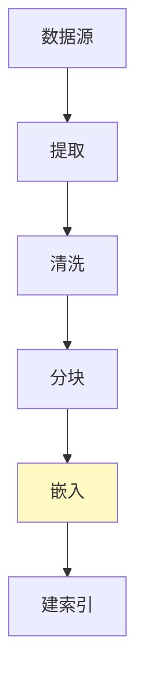
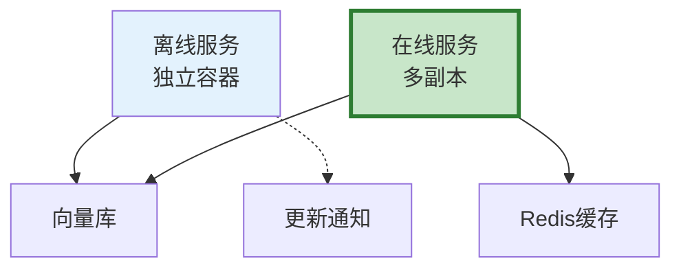

# RAG 离线在线分离图解

> 用图解理解离线建库和在线检索的分离架构。

---

## 一、为什么需要分离

```mermaid
graph TB
    subgraph 混合 &#123;"混合: 互相影响"&#125;
        M1["摄入+查询同进程"] --> M2["❌ 摄入时查询慢"]
    end

    subgraph 分离 &#123;"分离: 互不影响"&#125;
        S1["离线: 批量建库"]
        S2["在线: 低延迟查询"]
    end

    style 混合 fill:#FFCDD2
    style 分离 fill:#C8E6C9
```

---

## 二、离线建库



---

## 三、在线检索

```mermaid
graph TB
    Q["查询"] --> CACHE&#123;"缓存?"&#125;
    CACHE -->|是| RET["返回"]
    CACHE -->|否| SEARCH["检索"] --> RERANK["重排序"] --> GEN["LLM生成"] --> OUT["返回"]

    style CACHE fill:#FFF9C4
    style GEN fill:#C8E6C9
```

---

## 四、部署架构



---

## 五、缓存一致性


---

## 六、检查清单

| 检查项 | 状态 |
|--------|------|
| 离线在线分离 | ☐ |
| 离线批量嵌入 | ☐ |
| 在线有缓存 | ☐ |
| 有缓存失效 | ☐ |
