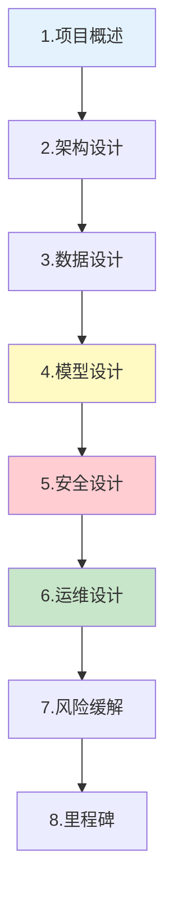

# 设计文档模板图解

> 用图解理解 LLM 应用设计文档的结构和评审流程。

---

## 一、文档结构



---

## 二、评审流程

```mermaid
graph LR
    DRAFT["初稿"] --> REVIEW["评审会"]
    REVIEW --> FEEDBACK["反馈"]
    FEEDBACK --> REVISE["修改"]
    REVISE --> APPROVE&#123;"通过?"&#125;
    APPROVE -->|是| BASELINE["基线确定"]
    APPROVE -->|否| REVISE

    style REVIEW fill:#FFF9C4
    style BASELINE fill:#C8E6C9
```

---

## 三、核心检查项

```mermaid
graph TB
    subgraph 检查 &#123;"设计文档检查"&#125;
        C1["目标可量化"]
        C2["架构图完整"]
        C3["数据流清晰"]
        C4["模型选型有理由"]
        C5["降级策略覆盖"]
        C6["安全威胁识别"]
        C7["SLO可测量"]
        C8["风险有缓解"]
    end

    style 检查 fill:#E3F2FD
```

---

## 四、检查清单

| 检查项 | 状态 |
|--------|------|
| 有标准模板 | ☐ |
| 有架构图 | ☐ |
| 有风险缓解 | ☐ |
| 有里程碑 | ☐ |
