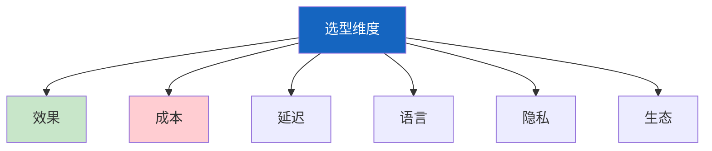
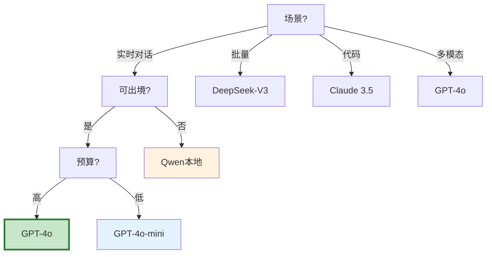
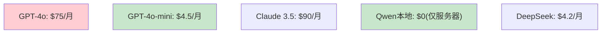

# 模型选型决策图解

> 用图解理解模型对比矩阵和场景化选型。

---

## 一、选型维度



---

## 二、场景化选型



---

## 三、成本对比



---

## 四、混合策略

```mermaid
graph TB
    subgraph 混合 &#123;"多模型组合"&#125;
        M1["80%→GPT-4o-mini"]
        M2["复杂→GPT-4o"]
        M3["代码→Claude 3.5"]
        M4["批量→DeepSeek"]
        M5["敏感→Qwen本地"]
    end

    style 混合 fill:#E3F2FD
```

---

## 五、检查清单

| 检查项 | 状态 |
|--------|------|
| 有多维对比 | ☐ |
| 按场景选模型 | ☐ |
| 有多模型路由 | ☐ |
| 有成本对比 | ☐ |
