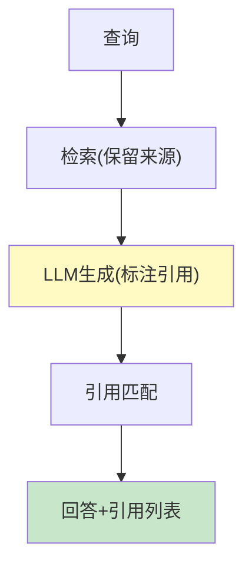

# RAG 引用溯源图解

> 用图解理解引用标注、来源追踪和置信度展示。

---

## 一、为什么需要引用

```mermaid
graph TB
    subgraph 无引用 &#123;"无引用"&#125;
        A["回答: '成立于2019年'"] --> Q["数据哪来的？❌"]
    end
    subgraph 有引用 &#123;"有引用"&#125;
        B["回答: '成立于2019年 [1]'"] --> S["[1]来源: 介绍.pdf 第3页 ✅"]
    end

    style 无引用 fill:#FFCDD2
    style 有引用 fill:#C8E6C9
```

---

## 二、溯源流程



---

## 三、引用验证

```mermaid
graph TB
    ANSWER["回答文本"] --> EXTRACT["提取[1][2]编号"]
    EXTRACT --> CHECK&#123;"编号合法？"&#125;
    CHECK -->|是| VALID["✅ 引用有效"]
    CHECK -->|否| INVALID["❌ 非法引用"]

    style CHECK fill:#FFF9C4
    style VALID fill:#C8E6C9
```

---

## 四、置信度展示

```mermaid
graph TB
    subgraph 置信度 &#123;"三级置信度"&#125;
        H["🟢 高(≥0.8)<br/>可信赖"]
        M["🟡 中(0.5-0.8)<br/>建议核实"]
        L["🔴 低(<0.5)<br/>可能不完整"]
    end

    style H fill:#C8E6C9
    style M fill:#FFF9C4
    style L fill:#FFCDD2
```

---

## 五、检查清单

| 检查项 | 状态 |
|--------|------|
| 回答有引用编号 | ☐ |
| 引用关联文档 | ☐ |
| 有引用验证 | ☐ |
| 有置信度展示 | ☐ |
