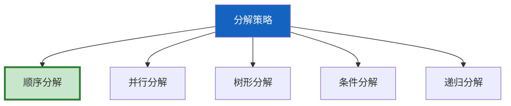
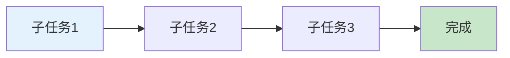
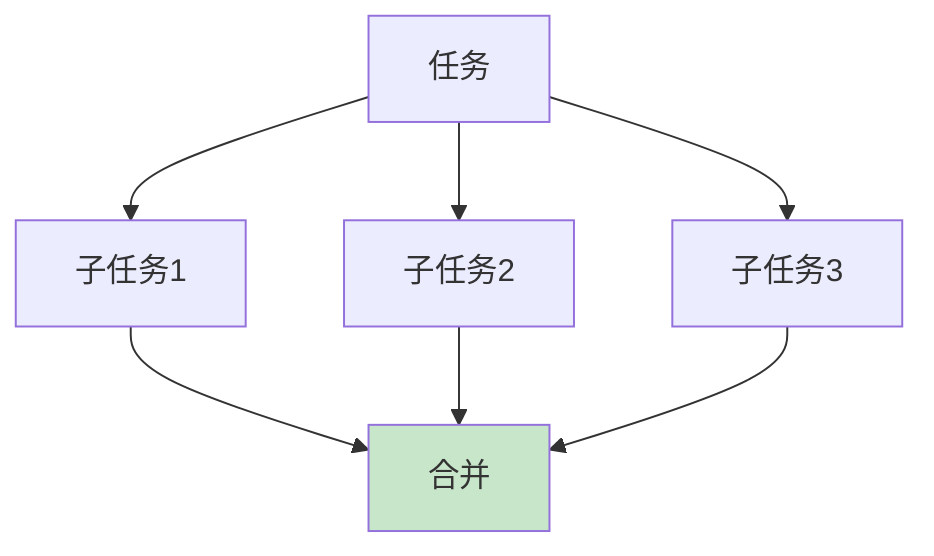
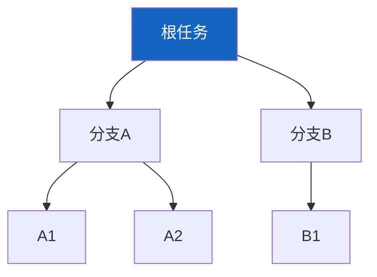

# Agent 任务分解图解

> 用图解理解 5 种分解策略和执行流程。

---

## 一、5种策略



---

## 二、顺序分解



---

## 三、并行分解



---

## 四、树形分解



---

## 五、条件分解

```mermaid
graph TB
    EXEC["执行第一步"] --> RESULT&#123;"结果?"&#125;
    RESULT -->|A| SA["子任务集A"]
    RESULT -->|B| SB["子任务集B"]

    style RESULT fill:#FFF9C4
```

---

## 六、策略对比

| 策略 | 关系 | 适合 | 复杂度 |
|------|------|------|--------|
| 顺序 | 线性依赖 | 有步骤 | 低 |
| 并行 | 独立 | 多源采集 | 中 |
| 树形 | 层级 | 超复杂 | 高 |
| 条件 | 动态 | 不确定 | 中 |
| 递归 | 自相似 | 可再分 | 高 |

---

## 七、检查清单

| 检查项 | 状态 |
|--------|------|
| 有任务分解器 | ☐ |
| 能顺序/并行分解 | ☐ |
| 能条件分解 | ☐ |
| 与LangGraph集成 | ☐ |
