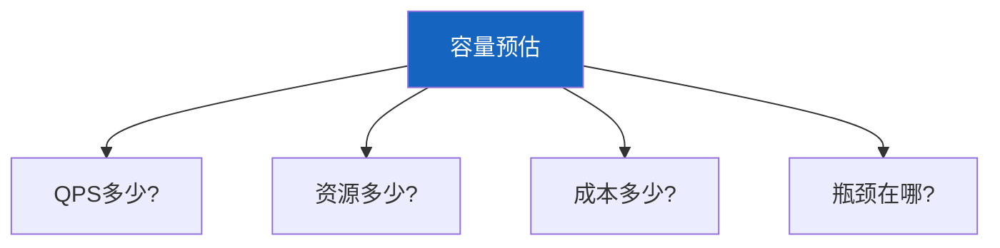
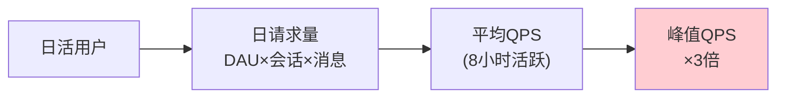
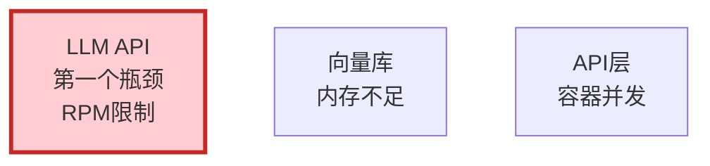

# 容量预估图解

> 用图解理解 QPS 预估、资源需求和瓶颈识别。

---

## 一、核心问题



---

## 二、QPS预估



---

## 三、资源需求

```mermaid
graph TB
    subgraph 资源 &#123;"资源需求"&#125;
        R1["API容器<br/>QPS×延迟/100"]
        R2["向量库内存<br/>文档量×维度"]
        R3["Redis缓存<br/>QPS×30"]
        R4["LLM API<br/>外部调用"]
    end

    style 资源 fill:#E3F2FD
```

---

## 四、瓶颈识别



---

## 五、检查清单

| 检查项 | 状态 |
|--------|------|
| 有QPS预估 | ☐ |
| 有资源规划 | ☐ |
| 有瓶颈分析 | ☐ |
| 有成本估算 | ☐ |
