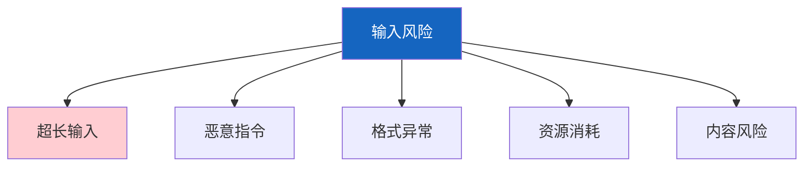
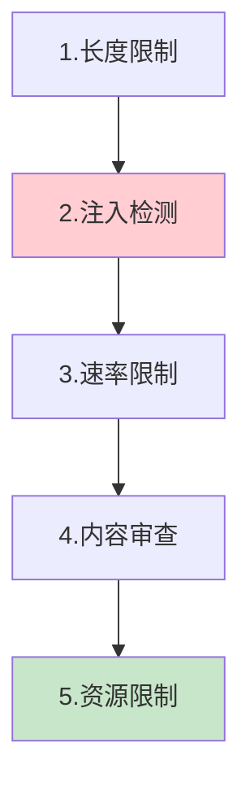

# Agent 边界防护图解

> 用图解理解输入验证、5层边界保护和优雅降级。

---

## 一、输入风险



---

## 二、5层边界



---

## 三、验证流程

```mermaid
graph TB
    INPUT["用户输入"] --> VALIDATE&#123;"验证"&#125;
    VALIDATE -->|安全| NORMAL["正常处理"]
    VALIDATE -->|警告| WARN["清洗后处理"]
    VALIDATE -->|危险| REJECT["拒绝"]
    VALIDATE -->|空| EMPTY["提示输入"]

    style VALIDATE fill:#FFF9C4
    style NORMAL fill:#C8E6C9
    style REJECT fill:#FFCDD2
```

---

## 四、检查清单

| 检查项 | 状态 |
|--------|------|
| 有输入验证 | ☐ |
| 有长度限制 | ☐ |
| 有注入检测 | ☐ |
| 有输出边界 | ☐ |
