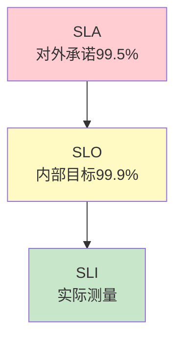

# SLA 与错误预算图解

> 用图解理解 SLA/SLO/SLI 三层关系和错误预算机制。

---

## 一、三层关系



---

## 二、核心SLI

```mermaid
graph TB
    subgraph SLI &#123;"LLM应用核心SLI"&#125;
        M1["可用性 99.9%"]
        M2["P95延迟 <3s"]
        M3["错误率 <1%"]
        M4["质量评分 >85%"]
        M5["缓存命中 >30%"]
    end

    style SLI fill:#E3F2FD
```

---

## 三、错误预算

```mermaid
graph TB
    SLO["SLO 99.9%"] --> BUDGET["错误预算<br/>每月43分钟故障"]
    BUDGET --> USED["已用20分钟"]
    USED --> REMAIN["剩余23分钟"]
    REMAIN --> DECISION&#123;"用完?"&#125;
    DECISION -->|否| FEATURE["可发新功能"]
    DECISION -->|是| FREEZE["冻结新功能"]

    style BUDGET fill:#FFF9C4,stroke:#F9A825,stroke-width:3px
    style FEATURE fill:#C8E6C9
    style FREEZE fill:#FFCDD2
```

---

## 四、SLO闭环

```mermaid
graph LR
    S1["制定SLO"] --> S2["测量SLI"] --> S3["算预算"] --> S4&#123;"用完?"&#125;
    S4 -->|否| S5["正常迭代"]
    S4 -->|是| S6["冻结新功能"]
    S5 --> S7["回顾调整"]
    S6 --> S7
    S7 --> S1

    style S4 fill:#FFF9C4
```

---

## 五、检查清单

| 检查项 | 状态 |
|--------|------|
| 定义了SLI | ☐ |
| 有错误预算 | ☐ |
| 有告警规则 | ☐ |
| 有SLO闭环 | ☐ |
