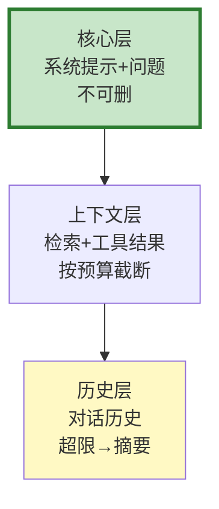

# Agent 上下文工程图解

> 用图解理解上下文窗口分配、组装策略和分层管理。

---

## 一、上下文窗口内容

```mermaid
graph TB
    subgraph 上下文 &#123;"上下文窗口"&#125;
        C1["系统提示 ~500"]
        C2["检索上下文 ~3000"]
        C3["对话历史 ~2000"]
        C4["用户输入 ~200"]
        C5["LLM输出预留 ~1300"]
    end

    style C2 fill:#FFF9C4,stroke:#F9A825,stroke-width:3px
    style C3 fill:#E3F2FD
```

---

## 二、4种组装策略

```mermaid
graph TB
    subgraph 策略 &#123;"4种策略"&#125;
        S1["优先级组装<br/>系统>用户>检索>历史"]
        S2["动态截断<br/>超限时删最早"]
        S3["摘要压缩<br/>历史→摘要"]
        S4["分层管理<br/>核心+扩展+参考"]
    end

    style 策略 fill:#C8E6C9
```

---

## 三、分层管理



---

## 四、Token预算分配

```mermaid
graph TB
    subgraph 分配 &#123;"8000 Token分配"&#125;
        A1["系统: 6%"]
        A2["检索: 37%"]
        A3["历史: 25%"]
        A4["用户: 3%"]
        A5["输出: 16%"]
    end

    style A2 fill:#FFF9C4
```

---

## 五、检查清单

| 检查项 | 状态 |
|--------|------|
| 有预算管理 | ☐ |
| 有优先级组装 | ☐ |
| 有历史压缩 | ☐ |
| 有分层管理 | ☐ |
