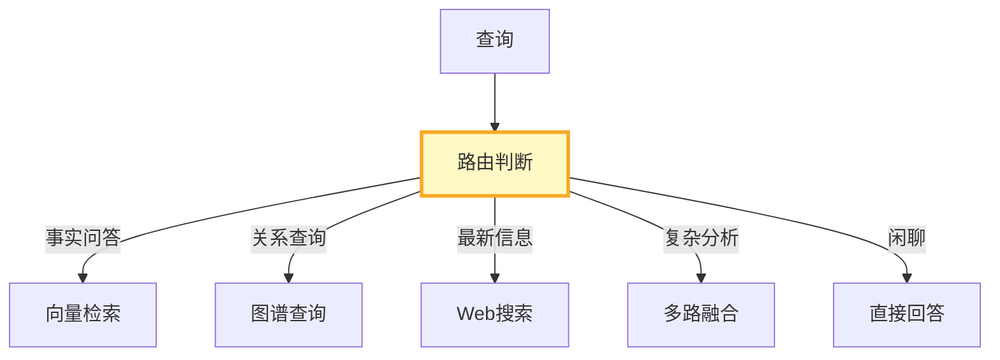
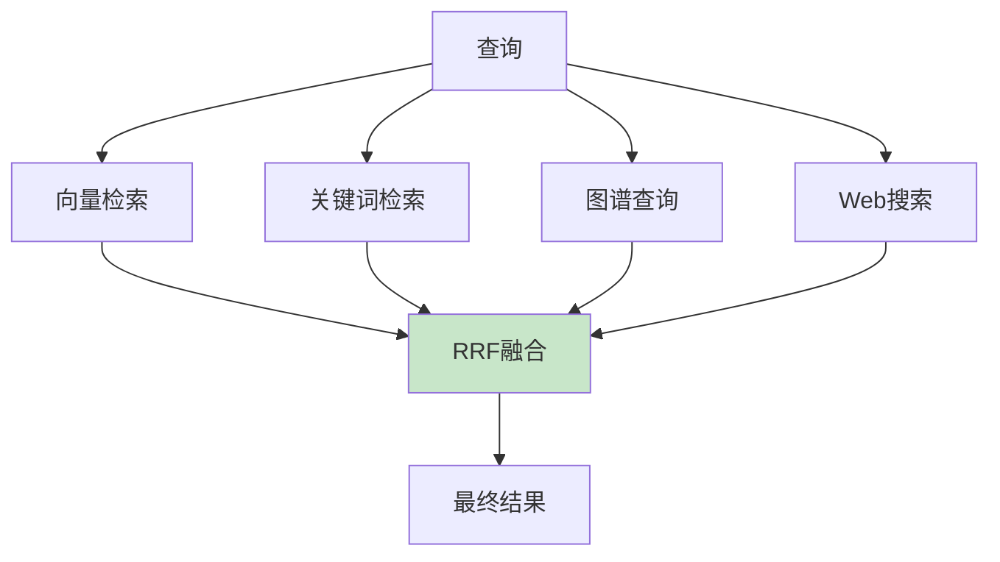

# RAG 查询路由图解

> 用图解理解路由决策、多路检索和RRF融合。

---

## 一、查询路由



---

## 二、规则路由

```mermaid
graph TB
    Q["查询"] --> R1&#123;"含ID/编号?"&#125;
    R1 -->|是| KW["关键词检索"]
    R1 -->|否| R2&#123;"需最新?"&#125;
    R2 -->|是| WEB["Web搜索"]
    R2 -->|否| R3&#123;"关系查询?"&#125;
    R3 -->|是| GRAPH["图谱查询"]
    R3 -->|否| VEC["向量检索"]

    style R1 fill:#FFF9C4
```

---

## 三、多路融合



---

## 四、检查清单

| 检查项 | 状态 |
|--------|------|
| 有查询路由器 | ☐ |
| 有多路检索 | ☐ |
| 有RRF融合 | ☐ |
| 有路由评估 | ☐ |
