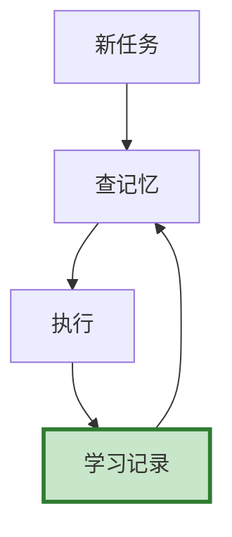

# Agent 知识管理图解

> 用图解理解组织记忆三层结构和学习闭环。

---

## 一、三层组织记忆

```mermaid
graph TB
    subgraph 记忆 &#123;"组织记忆"&#125;
        L1["操作记忆<br/>工具调用模式"]
        L2["决策记忆<br/>成功/失败方案"]
        L3["领域记忆<br/>领域知识积累"]
    end

    style 记忆 fill:#E3F2FD
    style L1 fill:#C8E6C9,stroke:#2E7D32,stroke-width:3px
```

---

## 二、学习闭环



---

## 三、操作记忆

```mermaid
graph TB
    subgraph 操作 &#123;"操作记忆"&#125;
        R1["记录: 任务类型+工具+成功/失败"]
        R2["统计: 各工具成功率"]
        R3["推荐: 成功率最高的工具"]
    end

    style 操作 fill:#E3F2FD
```

---

## 四、决策记忆

```mermaid
graph TB
    subgraph 决策 &#123;"决策记忆"&#125;
        S["成功方案<br/>可复用"]
        F["失败方案<br/>避免重蹈覆辙"]
        L["经验教训"]
    end

    style S fill:#C8E6C9
    style F fill:#FFCDD2
```

---

## 五、检查清单

| 检查项 | 状态 |
|--------|------|
| 有操作记忆 | ☐ |
| 有决策记忆 | ☐ |
| 有领域记忆 | ☐ |
| 有学习机制 | ☐ |
