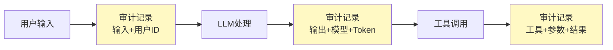
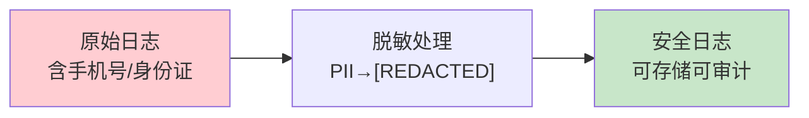

# 合规审计图解

> 用图解理解审计日志、合规检查和数据生命周期。

---

## 一、合规审计要求

```mermaid
graph TB
    subgraph 合规 &#123;"5大要求"&#125;
        A1["操作可追溯"]
        A2["内容可审计"]
        A3["数据可追踪"]
        A4["权限可验证"]
        A5["合规可证明"]
    end

    style 合规 fill:#E3F2FD
    style A5 fill:#C8E6C9,stroke:#2E7D32,stroke-width:3px
```

---

## 二、审计日志流



---

## 三、审计日志脱敏



---

## 四、数据生命周期


---

## 五、检查清单

| 检查项 | 状态 |
|--------|------|
| 有审计日志 | ☐ |
| 有脱敏处理 | ☐ |
| 有合规检查 | ☐ |
| 有数据生命周期 | ☐ |
