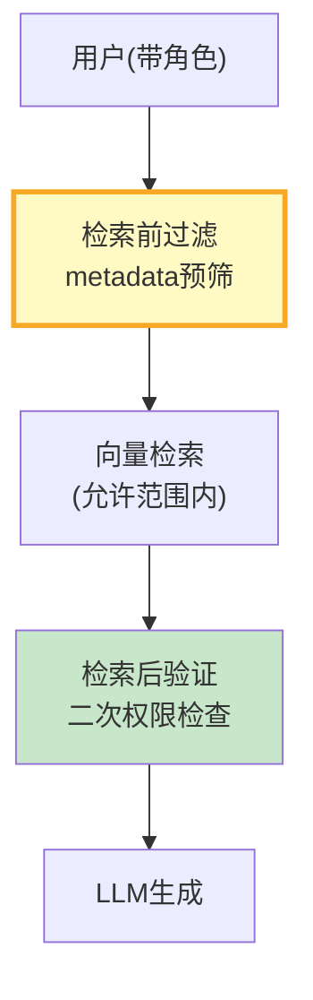
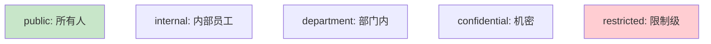

# 文档级权限图解

> 用图解理解权限模型、检索前过滤和检索后验证。

---

## 一、权限控制架构



---

## 二、访问级别



---

## 三、权限检查

```mermaid
graph TB
    CHECK&#123;"权限检查"&#125; --> EXCLUDE&#123;"在排除列表?"&#125;
    EXCLUDE -->|是| DENY["❌ 拒绝"]
    EXCLUDE -->|否| LEVEL&#123;"访问级别?"&#125;
    LEVEL -->|public| ALLOW["✅ 允许"]
    LEVEL -->|其他| ROLE&#123;"角色/部门匹配?"&#125;
    ROLE -->|是| ALLOW
    ROLE -->|否| DENY

    style DENY fill:#FFCDD2
    style ALLOW fill:#C8E6C9
```

---

## 四、检查清单

| 检查项 | 状态 |
|--------|------|
| 有ACL模型 | ☐ |
| 有检索前过滤 | ☐ |
| 有检索后验证 | ☐ |
| 有权限缓存 | ☐ |
