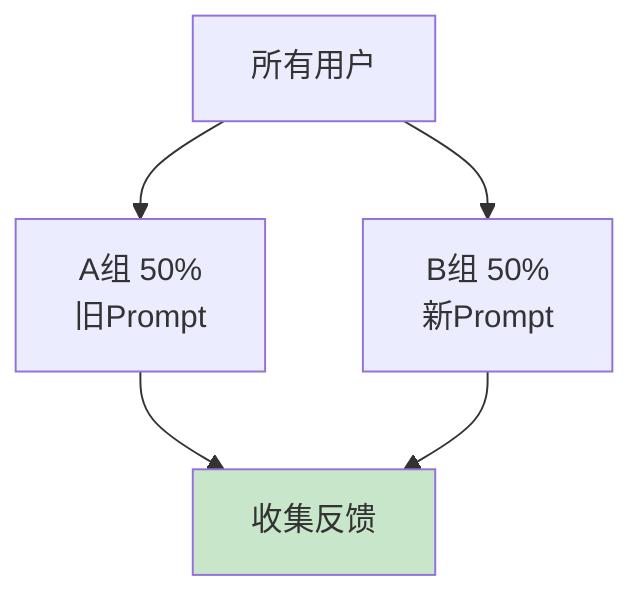

# A/B 测试图解

> 用图解理解实验设计、流量分组和统计分析。

---

## 一、A/B流程


---

## 二、流量分组



---

## 三、统计显著性

```mermaid
graph TB
    DELTA&#123;"差异Δ>0?"&#125; --> SIGNIFICANT&#123;"统计显著?"&#125;
    SIGNIFICANT -->|是| WINNER["采用B"]
    SIGNIFICANT -->|否| CONTINUE["继续实验"]
    DELTA -->|否| KEEP["保持A"]

    style WINNER fill:#C8E6C9
    style KEEP fill:#E3F2FD
```

---

## 四、检查清单

| 检查项 | 状态 |
|--------|------|
| 有实验管理 | ☐ |
| 有流量分组 | ☐ |
| 有统计分析 | ☐ |
