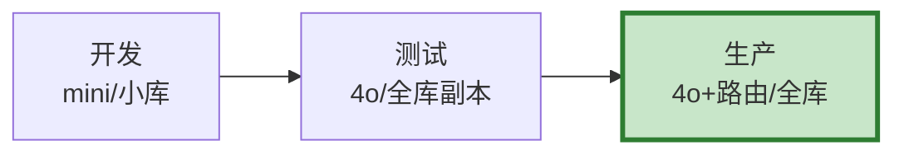

# 多环境管理图解

> 用图解理解三套环境、配置管理和数据同步。

---

## 一、三套环境



---

## 二、配置差异

```mermaid
graph TB
    subgraph 差异 &#123;"各环境差异"&#125;
        D1["开发: 无缓存/无追踪"]
        D2["测试: 有缓存/有追踪"]
        D3["生产: 有缓存+监控+告警"]
    end

    style 差异 fill:#E3F2FD
```

---

## 三、检查清单

| 检查项 | 状态 |
|--------|------|
| 有三套配置 | ☐ |
| API Key分环境 | ☐ |
| 有同步机制 | ☐ |
