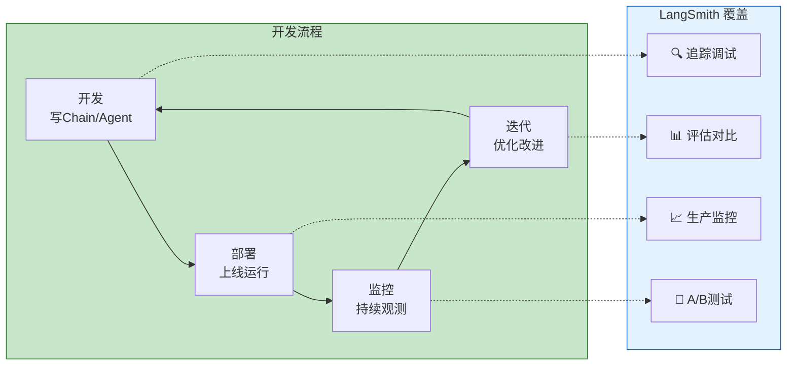
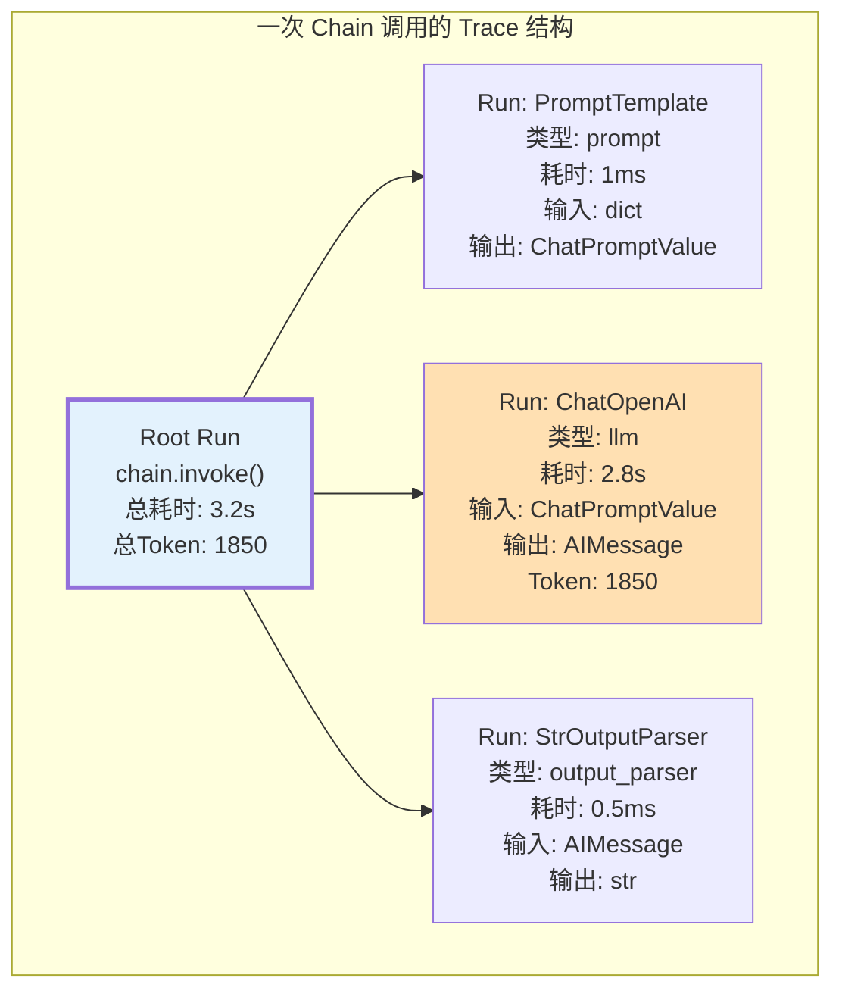
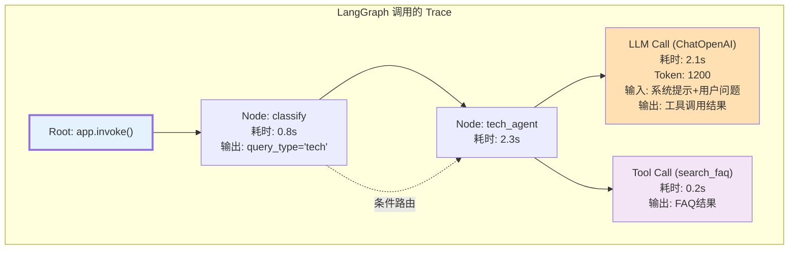
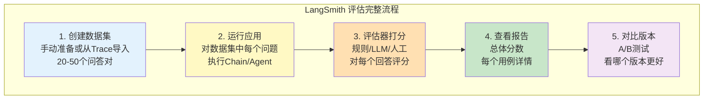
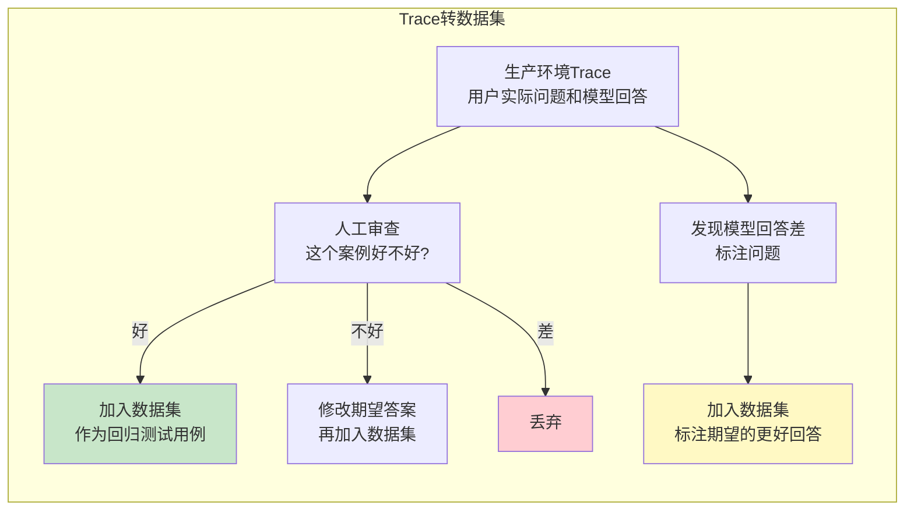
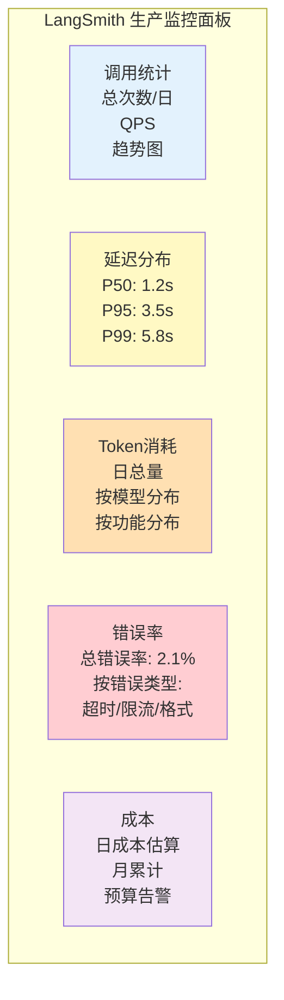

# LangSmith 可观测性图解

> 用图解方式理解 LangSmith 的追踪、评估和监控能力。

---

## 一、LangSmith 在开发流程中的位置



## 二、Trace 追踪层级



### LangGraph 的 Trace



## 三、评估工作流



### 从生产 Trace 创建测试用例



## 四、监控面板



## 五、A/B 测试流程

```mermaid
graph TB
    subgraph AB测试 ["LangSmith A/B 测试"]
        DS["共享数据集<br/>(同一批测试问题)"]
        DS --> A["版本A<br/>Prompt V1<br/>temperature=0"]
        DS --> B["版本B<br/>Prompt V2<br/>temperature=0.3"]

        A --> EA["评估A<br/>准确性: 85%<br/>延迟: 2.1s<br/>Token: 1200"]
        B --> EB["评估B<br/>准确性: 91%<br/>延迟: 2.5s<br/>Token: 1500"]

        EA --> COMPARE["对比报告"]
        EB --> COMPARE

        COMPARE --> DECISION&#123;"B更准确但更慢更贵<br/>选哪个?"&#125;
        DECISION -->|"准确性优先"| CHOOSE_B["选B"]
        DECISION -->|"成本优先"| CHOOSE_A["选A"]
    end

    style DS fill:#E3F2FD
    style EA fill:#C8E6C9
    style EB fill:#C8E6C9
    style COMPARE fill:#FFF9C4
```

## 六、自定义元数据与标签

```mermaid
graph TB
    subgraph 元数据体系 ["通过元数据组织追踪"]
        T1["按功能分组<br/>tag: 'chat' / 'rag' / 'agent'"]
        T2["按环境分组<br/>tag: 'dev' / 'staging' / 'prod'"]
        T3["按版本分组<br/>tag: 'v1.0' / 'v1.1'"]
        T4["按用户分组<br/>metadata: &#123;user_id: 'xxx'&#125;"]
    end

    T1 --> FILTER["在LangSmith界面<br/>按tag/metadata筛选<br/>快速定位问题"]

    style FILTER fill:#C8E6C9
```



```python
# 生产环境中的元数据标记
response = chain.invoke(
    &#123;"input": "用户问题"&#125;,
    config=&#123;
        "tags": ["prod", "rag", "v2.1"],
        "metadata": &#123;
            "user_id": "user_12345",
            "session_id": "sess_abc",
            "feature": "knowledge_base_qa",
            "model": "gpt-4o-mini",
        &#125;
    &#125;
)

# 在 LangSmith 中可以：
# 1. 按 tag="prod" 筛选所有生产调用
# 2. 按 metadata.user_id 筛选特定用户
# 3. 按 tag="v2.1" 对比版本
```
