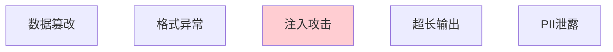

# 工具结果验证图解

> 用图解理解工具结果的风险和验证流程。

---

## 一、结果风险



---

## 二、验证流程

```mermaid
graph TB
    RESULT["工具结果"] --> TYPE&#123;"类型检查"&#125;
    TYPE -->|通过| LENGTH&#123;"长度检查"&#125;
    LENGTH -->|通过| DANGER&#123;"危险模式?"&#125;
    DANGER -->|无| PII&#123;"PII检查"&#125;
    PII -->|无| VALID["✅ 可用"]
    DANGER -->|有| FILTER["过滤+脱敏"]
    PII -->|有| FILTER

    style VALID fill:#C8E6C9
    style FILTER fill:#FFF9C4
```

---

## 三、检查清单

| 检查项 | 状态 |
|--------|------|
| 有结果验证器 | ☐ |
| 有长度限制 | ☐ |
| 有危险检测 | ☐ |
