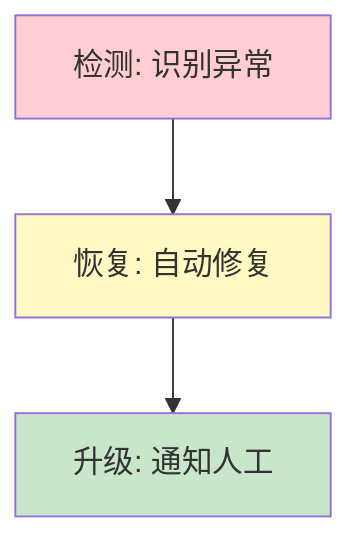

# Agent 自愈图解

> 用图解理解异常检测、自动恢复和升级机制。

---

## 一、自愈三层



---

## 二、异常类型


---

## 三、恢复流程

```mermaid
graph TB
    DETECT["检测到异常"] --> RECOVER&#123;"尝试自愈"&#125;
    RECOVER -->|成功| RESUME["继续执行"]
    RECOVER -->|失败| ESCALATE["升级通知人工"]

    style RECOVER fill:#FFF9C4
    style RESUME fill:#C8E6C9
```

---

## 四、检查清单

| 检查项 | 状态 |
|--------|------|
| 有异常检测器 | ☐ |
| 有恢复策略 | ☐ |
| 有升级机制 | ☐ |
