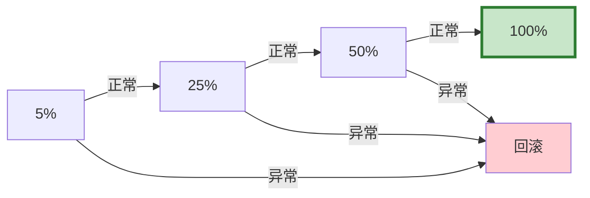

# 灰度发布图解

> 用图解理解金丝雀发布、特性开关和自动回滚。

---

## 一、金丝雀发布



---

## 二、特性开关

```mermaid
graph TB
    FLAG&#123;"特性开关"&#125; -->|开启| ON["功能启用"]
    FLAG -->|关闭| OFF["功能禁用<br/>秒级生效"]

    style FLAG fill:#FFF9C4
```

---

## 三、健康检查

```mermaid
graph TB
    METRICS["当前指标"] --> CHECK&#123;"检查"&#125;
    CHECK -->|错误率>5%| ROLL["回滚"]
    CHECK -->|延迟>5s| ROLL
    CHECK -->|正常| ADVANCE["推进下一阶段"]

    style CHECK fill:#FFF9C4
    style ROLL fill:#FFCDD2
    style ADVANCE fill:#C8E6C9
```

---

## 四、检查清单

| 检查项 | 状态 |
|--------|------|
| 有金丝雀发布 | ☐ |
| 有特性开关 | ☐ |
| 有自动回滚 | ☐ |
