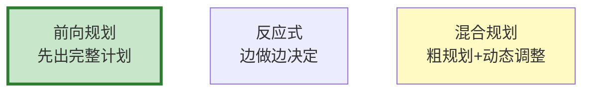

# Agent 规划策略图解

> 用图解理解三种规划模式和推理链管理。

---

## 一、三种规划模式



---

## 二、混合规划流程

```mermaid
graph TB
    GOAL["目标"] --> PLAN["粗略规划"]
    PLAN --> EXEC["执行"] --> OBSERVE["观察"]
    OBSERVE --> ADJUST&#123;"需要调整?"&#125;
    ADJUST -->|是| REPLAN["重新规划"]
    ADJUST -->|否| NEXT["下一步"]
    REPLAN --> NEXT

    style PLAN fill:#FFF9C4
    style ADJUST fill:#E3F2FD
```

---

## 三、检查清单

| 检查项 | 状态 |
|--------|------|
| 有前向规划器 | ☐ |
| 有推理链管理 | ☐ |
| 有重新规划 | ☐ |
