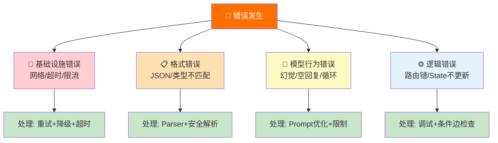
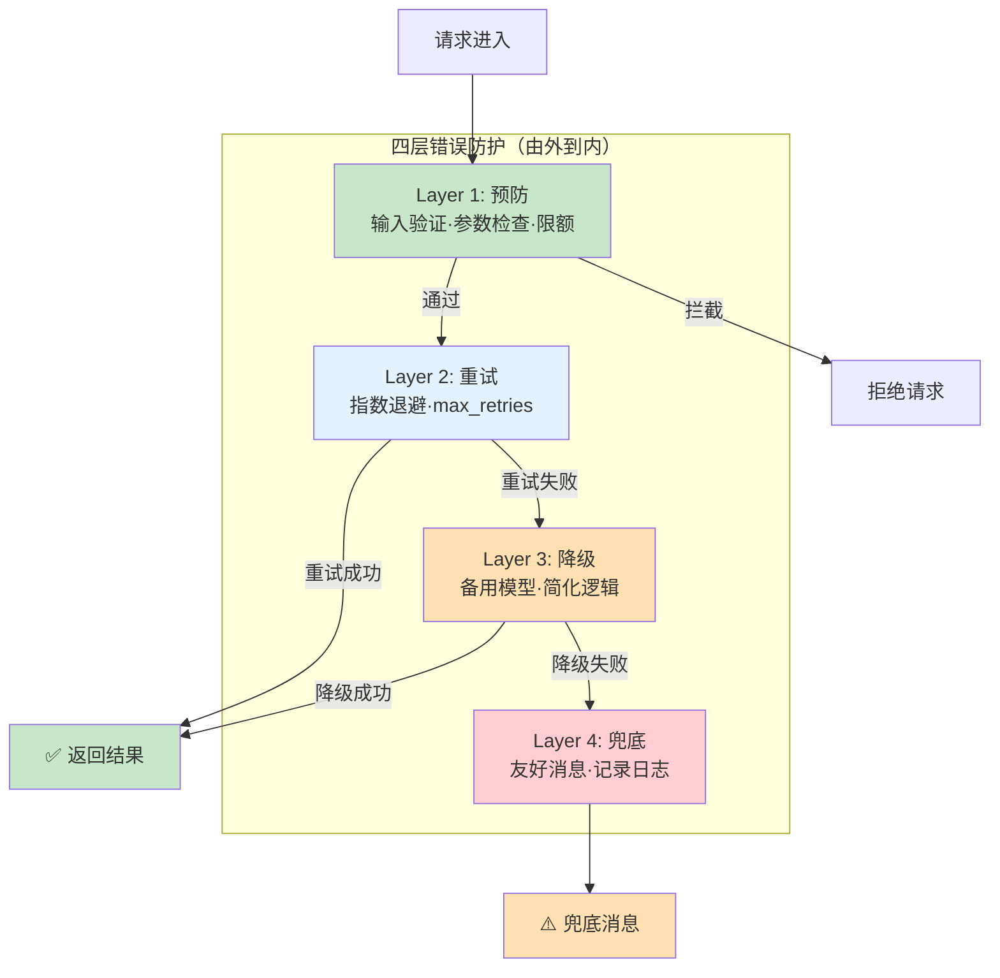
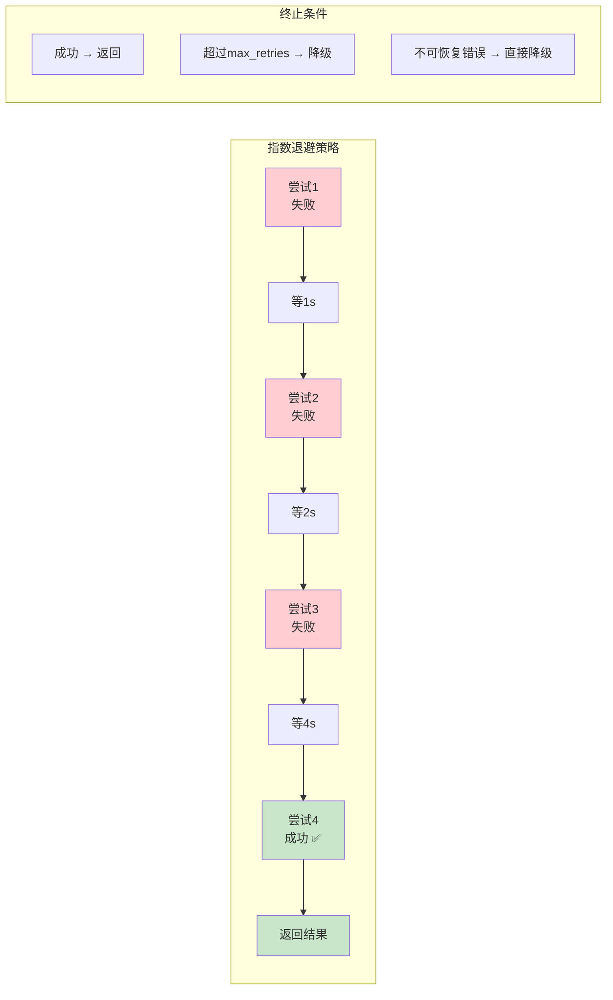
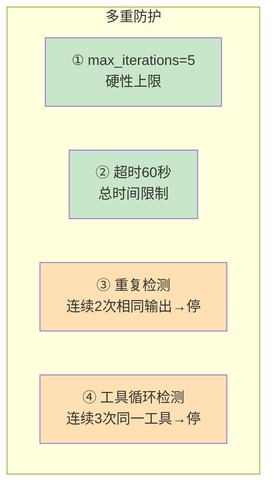
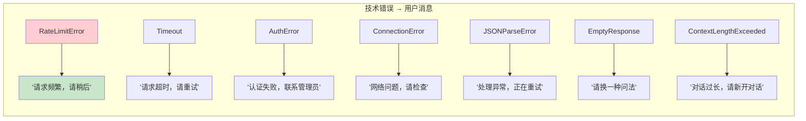

# 错误处理与降级策略图解

> 用图解方式理解 LLM 应用的错误分类、处理流程和降级策略。

---

## 一、错误分类全景



## 二、四层防护体系



## 三、重试与指数退避



## 四、多模型降级链

```mermaid
graph TD
    CALL["调用LLM"] --> M1&#123;"主模型<br/>GPT-4o-mini"&#125;
    M1 -->|"成功"| OK["✅ 返回"]
    M1 -->|"失败<br/>(超时/限流/不可用)"| M2&#123;"备用模型<br/>通义千问"&#125;
    M2 -->|"成功"| OK
    M2 -->|"失败"| M3&#123;"兜底模型<br/>Ollama本地"&#125;
    M3 -->|"成功"| OK
    M3 -->|"失败"| FALLBACK["❌ 全部不可用<br/>返回友好错误消息"]

    style OK fill:#C8E6C9
    style FALLBACK fill:#FFCDD2
    style M1 fill:#E3F2FD
    style M2 fill:#FFE0B2
    style M3 fill:#F3E5F5
```

## 五、格式错误处理流程

```mermaid
graph TB
    LLM_OUT["LLM输出文本"] --> P1&#123;"直接JSON解析"&#125;
    P1 -->|"成功"| OK1["✅"]
    P1 -->|"失败"| P2&#123;"提取```json代码块"&#125;
    P2 -->|"成功"| OK2["✅"]
    P2 -->|"失败"| P3&#123;"找第一个&#123;到最后一个&#125;"&#125;
    P3 -->|"成功"| OK3["✅"]
    P3 -->|"失败"| FALLBACK["降级：<br/>1.用with_structured_output替代<br/>2.加Few-Shot重试<br/>3.返回原始文本"]

    style OK1 fill:#C8E6C9
    style OK2 fill:#C8E6C9
    style OK3 fill:#C8E6C9
    style FALLBACK fill:#FFE0B2
```

## 六、Agent 无限循环防护



## 七、LangGraph 节点错误处理

```mermaid
graph TB
    START([START]) --> NODE["处理节点<br/>try-catch"]
    NODE --> CHECK&#123;"有错误?"&#125;
    CHECK -->|"无"| NEXT["正常继续"]
    CHECK -->|"有"| HANDLER["错误处理节点"]
    HANDLER --> DECIDE&#123;"可恢复?"&#125;
    DECIDE -->|"是<br/>(如超时)"| RETRY["重试"]
    RETRY --> NODE
    DECIDE -->|"否<br/>(如认证失败)"| FALLBACK["降级回答"]
    FALLBACK --> END([END])
    NEXT --> END

    style NODE fill:#E3F2FD
    style CHECK fill:#FFF9C4
    style HANDLER fill:#FFCDD2
    style RETRY fill:#FFE0B2
    style FALLBACK fill:#FFCDD2
    style NEXT fill:#C8E6C9
```

## 八、用户友好错误消息映射


