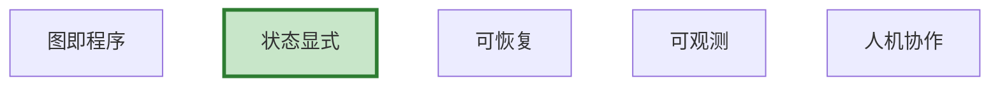

# LangGraph 架构图解

> 用图解理解设计理念和核心抽象。

---

## 一、设计理念



---

## 二、执行模型

```mermaid
graph TB
    START --> NODE1["节点1"] --> CP["检查点"]
    CP --> ROUTE&#123;"路由"&#125; --> NODE2["节点2"]
    ROUTE --> NODE3["节点3"]
    NODE2 & NODE3 --> END

    style CP fill:#FFF9C4
```

---

## 三、检查清单

| 检查项 | 状态 |
|--------|------|
| 理解设计理念 | ☐ |
| 理解核心抽象 | ☐ |
