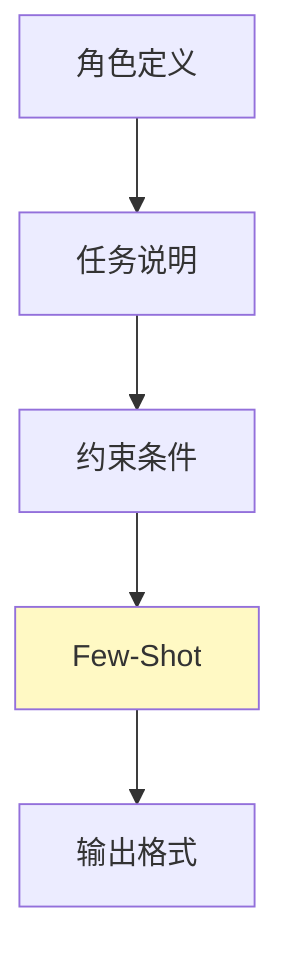

# Prompt 工程图解

> 用图解理解 Prompt 五要素和模板设计。

---

## 一、五要素

```mermaid
graph TB
    E1["角色定义"] --> E2["任务说明"]
    E2 --> E3["约束条件"]
    E3 --> E4["Few-Shot"]
    E4 --> E5["输出格式"]

    style E4 fill:#FFF9C4
```

---

## 二、好vs坏

```mermaid
graph TB
    BAD["❌ '回答: &#123;q&#125;'"]
    GOOD["✅ 角色+信息+规则+问题"]

    style BAD fill:#FFCDD2
    style GOOD fill:#C8E6C9
```

---

## 三、检查清单

| 检查项 | 状态 |
|--------|------|
| 有五要素 | ☐ |
| 有好坏对比 | ☐ |
