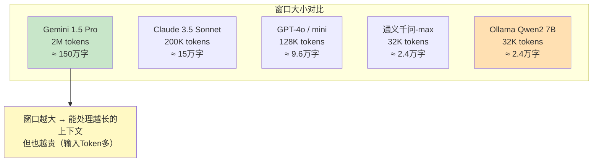

# Token 与上下文窗口管理图解

> 用图解理解上下文窗口的构成、Token 消耗的增长规律和截断策略。

---

## 一、上下文窗口的构成

```mermaid
graph TB
    subgraph 上下文窗口 ["模型上下文窗口（GPT-4o-mini: 128K tokens）"&#125;
        SYS["System Prompt<br/>~150-300 tokens<br/>设定角色和规则"]
        HIST["对话历史<br/>随轮数增长<br/>第1轮: 100t / 第10轮: 2000t / 第50轮: 15000t"]
        CTX["RAG上下文<br/>~500-2000 tokens<br/>检索到的文档片段"]
        Q["用户问题<br/>~20-100 tokens"]
        A["LLM输出空间<br/>~100-500 tokens"]
    end

    SYS & HIST & CTX & Q & A --> TOTAL["总消耗"]

    NOTE["上下文窗口 = 输入Token + 输出Token<br/>不能超过模型上限"]

    style 上下文窗口 fill:#E3F2FD
    style NOTE fill:#FFF9C4
```

## 二、对话轮数与 Token 增长

```mermaid
graph LR
    subgraph Token增长 ["对话轮数与Token消耗（累积）"&#125;
        R1["第1轮<br/>输入: 250t<br/>输出: 100t<br/>总计: 350t"]
        R2["第5轮<br/>输入: 1000t<br/>输出: 100t<br/>总计: 1100t"]
        R3["第10轮<br/>输入: 2500t<br/>输出: 100t<br/>总计: 2600t"]
        R4["第20轮<br/>输入: 6000t<br/>输出: 100t<br/>总计: 6100t"]
        R5["第50轮<br/>输入: 20000t<br/>输出: 100t<br/>总计: 20100t"]
    end

    R1 --> R2 --> R3 --> R4 --> R5

    NOTE["⚠️ 第50轮时<br/>输入Token是第1轮的80倍"]

    style Token增长 fill:#FFE0B2
    style NOTE fill:#FFCDD2
```

## 三、三种历史截断策略

```mermaid
graph TB
    subgraph 窗口截断 ["策略一：窗口截断（最简单）"&#125;
        W1["全量历史: [msg1, msg2, ..., msg50]"]
        W2["截断后: [msg41, ..., msg50]<br/>只保留最近10条"]
        W3["✅ 简单快速<br/>❌ 丢失早期信息"]
    end

    subgraph Token截断 ["策略二：Token感知截断（精确）"&#125;
        T1["全量历史: 20000 tokens"]
        T2["从后往前保留<br/>直到达到4000 tokens上限"]
        T3["✅ 精确控制不超限<br/>❌ 仍丢失早期信息"]
    end

    subgraph 摘要压缩 ["策略三：摘要压缩（最佳）"]
        S1["全量历史: [msg1-50]"]
        S2["分割: 旧消息[msg1-40] + 近期[msg41-50]"]
        S3["旧消息 → LLM生成摘要<br/>~200 tokens"]
        S4["最终: [System(摘要), msg41, ..., msg50]"]
        S5["✅ 保留关键信息<br/>✅ Token可控<br/>❌ 增加一次LLM调用"]
    end

    style 窗口截断 fill:#E3F2FD
    style Token截断 fill:#FFF9C4
    style 摘要压缩 fill:#C8E6C9
```

### 摘要压缩的数据流

```mermaid
graph LR
    subgraph 压缩前 ["压缩前：50条消息 = 20000 tokens"&#125;
        M1["msg1-40: 18000 tokens"] --> M2["msg41-50: 2000 tokens"]
    end

    subgraph 压缩过程
        M1 --> SUM["LLM摘要<br/>~200 tokens"]
    end

    subgraph 压缩后 ["压缩后：12条消息 = 2200 tokens"&#125;
        S1["System: '摘要: 用户讨论了...'"]
        S2["msg41-50: 2000 tokens"]
    end

    SUM --> S1
    M2 --> S2

    style 压缩前 fill:#FFCDD2
    style 压缩后 fill:#C8E6C9
```

## 四、RAG 中的 Token 消耗

```mermaid
graph TB
    subgraph RAG调用 ["一次RAG调用的Token构成"&#125;
        SP["System Prompt<br/>~150 tokens (6%)"]
        CTX["RAG上下文<br/>~1500 tokens (60%)"]
        HIST["对话历史<br/>~500 tokens (20%)"]
        Q["用户问题<br/>~50 tokens (2%)"]
        A["LLM输出<br/>~300 tokens (12%)"]
    end

    NOTE["上下文(CTX)是Token消耗的大头<br/>优化RAG的Token消耗 = 优化上下文"]

    style CTX fill:#FFE0B2,stroke-width:3px
    style NOTE fill:#FFF9C4
```

### RAG 上下文优化

```mermaid
graph TB
    subgraph 优化前 ["优化前：k=5, chunk_size=500"&#125;
        O1["5个chunk × 500 tokens<br/>= 2500 tokens"]
    end

    subgraph 优化后 ["优化后：k=3, chunk_size=300"&#125;
        N1["3个chunk × 300 tokens<br/>= 900 tokens"]
        N2["节省: 64%"]
    end

    优化前 -.->|"减小k值"| 优化后

    style 优化前 fill:#FFCDD2
    style 优化后 fill:#C8E6C9
```

## 五、Token 管理决策树

```mermaid
graph TD
    Q&#123;"Token超限或想优化?"&#125;
    Q -->|"对话历史太长"| Q1&#123;"需要早期信息?"&#125;
    Q -->|"RAG上下文太长"| Q2&#123;"检索质量好?"&#125;
    Q -->|"System Prompt太长"| Q3["精简Prompt"]
    Q -->|"输出太长"| Q4["设max_tokens"]

    Q1 -->|"否"| S1["窗口截断"]
    Q1 -->|"是"| S2["摘要压缩"]

    Q2 -->|"好"| S3["减小k: 5→3"]
    Q2 -->|"不好"| S4["减小chunk_size<br/>保持k值"]

    style S1 fill:#C8E6C9
    style S2 fill:#C8E6C9
    style S3 fill:#E3F2FD
    style S4 fill:#FFF9C4
    style Q3 fill:#E3F2FD
    style Q4 fill:#F3E5F5
```

## 六、各模型上下文窗口对比



## 七、Token 估算速查

| 内容类型 | 大约Token数 |
|----------|------------|
| 1个中文字 | ~1.5 tokens |
| 1个英文单词 | ~1 token |
| 1个中文句子(10字) | ~15 tokens |
| 1段中文(100字) | ~150 tokens |
| 1页中文(500字) | ~750 tokens |
| System Prompt(典型) | 150-300 tokens |
| 1轮对话(问+答) | 200-500 tokens |
| RAG上下文(k=3) | 900-2000 tokens |
