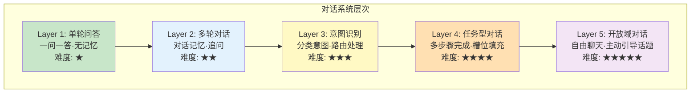
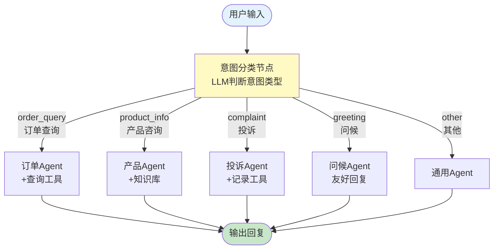
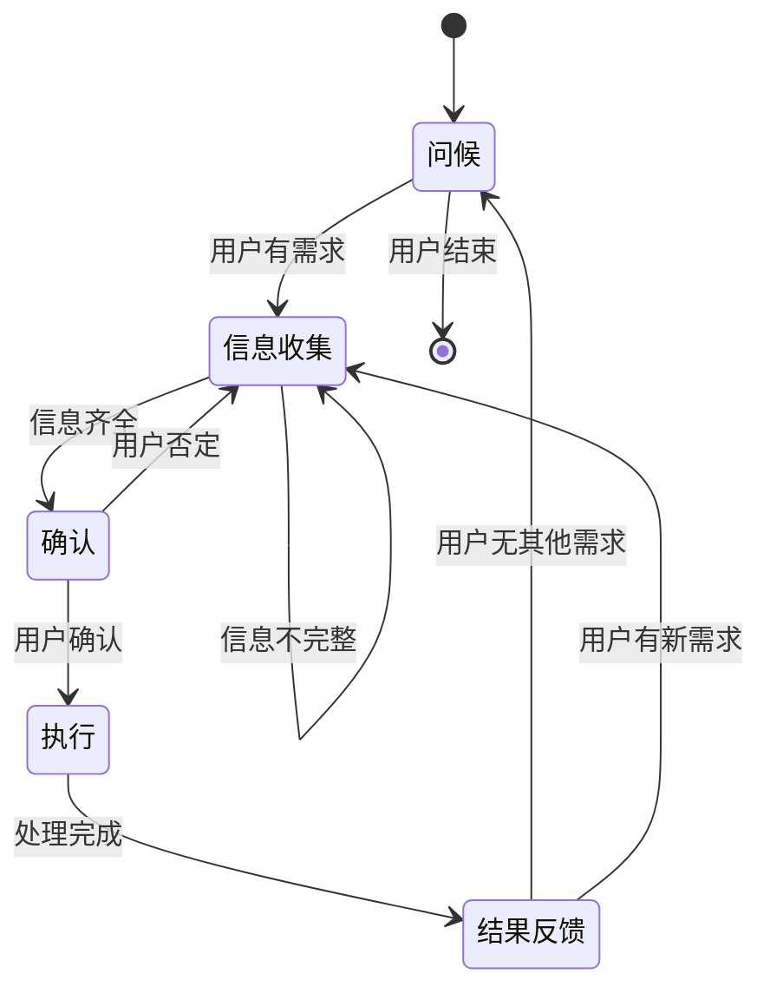

# 对话系统架构图解

> 用图解理解对话系统的层次结构、意图路由和状态管理。

---

## 一、对话系统五层模型



## 二、意图识别路由架构



## 三、任务型对话流程

```mermaid
graph TB
    START([START]) --> GREET["问候阶段<br/>'您好，需要什么帮助？'"]
    GREET --> COLLECT["信息收集阶段<br/>'请提供订单号'"]

    COLLECT --> CHECK1&#123;"信息齐全?"&#125;
    CHECK1 -->|"否"| ASK["追问缺失信息<br/>'请提供手机号'"]
    ASK --> COLLECT
    CHECK1 -->|"是"| CONFIRM["确认阶段<br/>'订单ORD001，确认？'"]

    CONFIRM --> CHECK2&#123;"用户确认?"&#125;
    CHECK2 -->|"否"| COLLECT
    CHECK2 -->|"是"| EXECUTE["执行阶段<br/>查询/处理"]

    EXECUTE --> RESULT["结果反馈<br/>'您的订单已发货'"]
    RESULT --> END_NODE["结束阶段<br/>'还有其他需要吗？'"]
    END_NODE --> GREET

    style GREET fill:#C8E6C9
    style COLLECT fill:#FFF9C4
    style CONFIRM fill:#FFE0B2
    style EXECUTE fill:#F3E5F5
    style RESULT fill:#E3F2FD
```

## 四、槽位填充示意

```mermaid
graph TB
    subgraph 槽位填充 &#123;"任务型对话的槽位填充"&#125;
        required["需要的信息(槽位)<br/>order_id: ?<br/>phone: ?"]
        
        U1["用户: '查订单'"] --> S1["order_id: 缺失<br/>phone: 缺失<br/>→ 问'订单号是？'"]
        
        U2["用户: 'ORD001'"] --> S2["order_id: ORD001 ✓<br/>phone: 缺失<br/>→ 问'手机号是？'"]
        
        U3["用户: '138xxxx'"] --> S3["order_id: ORD001 ✓<br/>phone: 138xxxx ✓<br/>→ 信息齐全，执行查询"]
    end

    style required fill:#E3F2FD
    style S3 fill:#C8E6C9
```

## 五、对话阶段状态流转



## 六、指代消解流程

```mermaid
graph LR
    subgraph 对话上下文 &#123;"多轮对话中的指代消解"&#125;
        R1["轮1: 用户: '蓝牙耳机的价格是多少？'<br/>AI: '299元'"]
        R2["轮2: 用户: '那个有保修吗？'"]
        
        R2 --> RES["指代消解:<br/>'那个' → '蓝牙耳机'"]
        RES --> R2R["消解后: '蓝牙耳机有保修吗？'"]
        R2R --> LLM["LLM处理<br/>(带完整上下文)"]
    end

    style RES fill:#FFF9C4
    style R2R fill:#C8E6C9
```

## 七、对话策略对比

```mermaid
graph TB
    subgraph 反应式 &#123;"反应式策略"&#125;
        R1["用户问→AI答"] --> R2["被动等待<br/>✅ 不会打扰<br/>❌ 可能错过引导机会"]
    end

    subgraph 主动式 &#123;"主动式策略"&#125;
        P1["AI主动提问/建议"] --> P2["✅ 引导用户<br/>✅ 提升体验<br/>❌ 可能打扰"]
    end

    subgraph 混合式 &#123;"混合式策略（推荐）"&#125;
        M1["回答+适时引导"] --> M2["✅ 最佳平衡<br/>✅ 上下文感知<br/>❌ 实现复杂"]
    end

    style 混合式 fill:#C8E6C9
```

## 八、系统选型决策

```mermaid
graph TD
    Q&#123;"对话场景?"&#125;
    Q -->|"简单FAQ"| S1["Layer 1<br/>单轮问答<br/>prompt | llm"]
    Q -->|"需要追问"| S2["Layer 2<br/>多轮对话<br/>RunnableWithMessageHistory"]
    Q -->|"多种问题类型"| S3["Layer 3<br/>意图识别<br/>LangGraph条件路由"]
    Q -->|"多步任务"| S4["Layer 4<br/>任务型对话<br/>槽位填充+阶段管理"]
    Q -->|"自由聊天"| S5["Layer 5<br/>开放域对话<br/>主动引导+记忆"]

    style S1 fill:#C8E6C9
    style S3 fill:#FFF9C4
    style S4 fill:#FFE0B2
    style S5 fill:#F3E5F5
```
