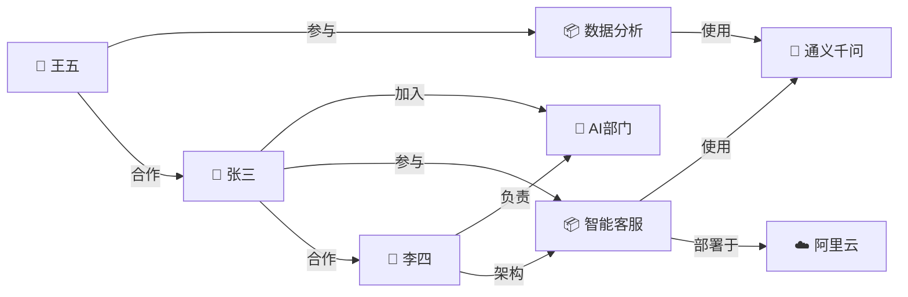
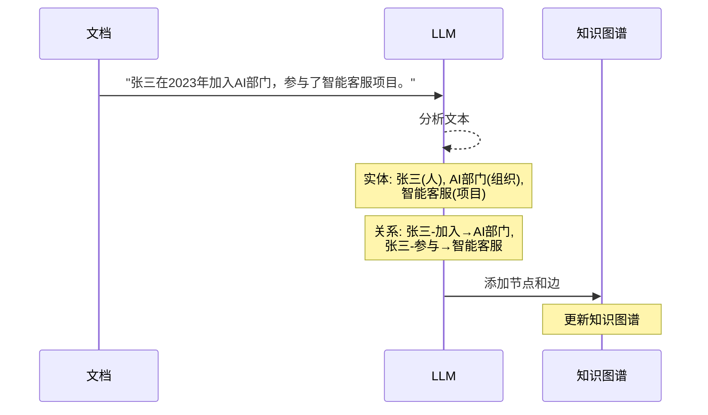

# 知识图谱 RAG 图解

> 用图解理解 GraphRAG 的原理、与传统 RAG 的区别和适用场景。

---

## 一、传统 RAG vs GraphRAG

```mermaid
graph TB
    subgraph 传统RAG ["传统 RAG（向量检索）"&#125;
        Q1["问题: '张三参与了哪些项目？'"]
        Q1 --> V1["向量化"]
        V1 --> S1["在向量库中找相似文本"]
        S1 --> R1["结果: 含'张三'的段落<br/>但可能遗漏关联项目"]
    end

    subgraph GraphRAG ["GraphRAG（关系检索）"&#125;
        Q2["问题: '张三参与了哪些项目？'"]
        Q2 --> E2["提取实体: '张三'"]
        E2 --> G2["在知识图谱中查找<br/>张三 --参与--> ?"]
        G2 --> R2["结果: 精确的关系链<br/>张三→参与→智能客服<br/>张三→参与→数据分析"]
    end

    style 传统RAG fill:#E3F2FD
    style GraphRAG fill:#C8E6C9
```

## 二、GraphRAG 架构

```mermaid
graph TB
    subgraph 离线建库
        D["📄 文档"] --> EXT["LLM实体关系抽取"]
        EXT --> KG[("🗄️ 知识图谱")]
        D --> VEC["向量化"]
        VEC --> VDB[("向量数据库")]
    end

    subgraph 在线查询
        Q["用户问题"] --> DET&#123;"问题类型?"&#125;
        DET -->|"事实查询<br/>'什么是X'"| VR["向量检索"]
        DET -->|"关系查询<br/>'X和Y什么关系'"| GR["图谱检索"]
        DET -->|"复杂查询"| BOTH["两者结合"]
    end

    KG --> GR
    VDB --> VR
    VR & GR & BOTH --> MERGE["合并上下文"]
    MERGE --> LLM["LLM生成回答"]

    style 离线建库 fill:#E3F2FD
    style 在线查询 fill:#FFF3E0
    style KG fill:#F3E5F5,stroke:#6A1B9A,stroke-width:3px
```

## 三、知识图谱结构



## 四、实体关系抽取流程



## 五、检索对比示意

```mermaid
graph TB
    subgraph 向量检索 &#123;"向量检索（找相似的）"&#125;
        VQ["问题: '张三和李四的关系'"]
        VQ --> VS["向量库搜索"]
        VS --> VR["返回: 含'张三'或'李四'的段落<br/>但可能没有直接描述他们关系的段落"]
    end

    subgraph 图谱检索 &#123;"图谱检索（找关联的）"&#125;
        GQ["问题: '张三和李四的关系'"]
        GQ --> GE["提取实体: 张三, 李四"]
        GE --> GS["图谱查找路径"]
        GS --> GR["张三 -合作→ 李四 ✅<br/>张三 -参与→ 智能客服 ←架构- 李四 ✅"]
    end

    style 向量检索 fill:#FFE0B2
    style 图谱检索 fill:#C8E6C9
```

## 六、选型决策

```mermaid
graph TD
    Q&#123;"问题类型?"&#125;
    Q -->|"'什么是X'（事实查询）"| V["✅ 传统RAG<br/>向量检索"]
    Q -->|"'X参与了什么'（关系查询）"| G["✅ GraphRAG<br/>图谱检索"]
    Q -->|"'X和Y什么关系'（关联查询）"| G
    Q -->|"'X的特点'（属性查询）"| V
    Q -->|"'X的技术架构和团队'（混合）"| B["✅ 两者结合"]

    style V fill:#C8E6C9
    style G fill:#E3F2FD
    style B fill:#F3E5F5
```
