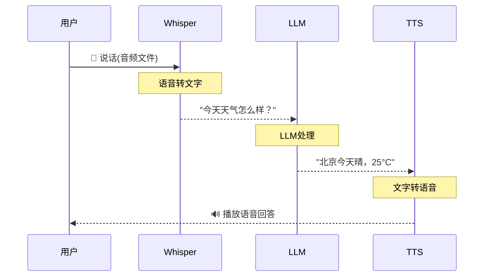

# 音频处理流水线图解

> 用图解理解语音输入(STT)、语音输出(TTS)和完整语音对话的流程。

---

## 一、音频能力全景

```mermaid
graph TB
    subgraph 音频能力 &#123;"LLM应用的音频三能力"&#125;
        STT["🎤 STT 语音转文字<br/>用户说话→文字<br/>模型: Whisper<br/>用途: 语音输入"]
        TTS["🔊 TTS 文字转语音<br/>LLM回答→语音<br/>模型: OpenAI TTS<br/>用途: 语音输出"]
        AUDIO["🎧 音频理解<br/>直接理解音频<br/>模型: GPT-4o-audio<br/>用途: 少一步转写"]
    end

    style STT fill:'#E3F2FD'
    style TTS fill:'#C8E6C9'
    style AUDIO fill:'#F3E5F5'
```

## 二、完整语音对话流程



## 三、Whisper 模型选择

```mermaid
graph TB
    subgraph 模型对比 &#123;"Whisper 本地模型大小对比"&#125;
        T["tiny (39MB)<br/>速度: 最快 ★★★★★<br/>准确: ★★<br/>适合: 实时对话"]
        B["base (74MB)<br/>速度: 快 ★★★★<br/>准确: ★★★<br/>适合: 通用场景"]
        S["small (244MB)<br/>速度: 中 ★★★<br/>准确: ★★★★<br/>适合: 高质量需求"]
        M["medium (769MB)<br/>速度: 慢 ★★<br/>准确: ★★★★☆<br/>适合: 精确转写"]
        L["large (1550MB)<br/>速度: 最慢 ★<br/>准确: ★★★★★<br/>适合: 最高质量"]
    end

    style T fill:'#C8E6C9'
    style B fill:'#C8E6C9'
    style L fill:'#FFCDD2'
```

## 四、TTS 声音选择

```mermaid
graph TB
    subgraph 声音选项 &#123;"OpenAI TTS 声音特性"&#125;
        A["alloy: 中性平衡<br/>→ 通用场景"]
        E["echo: 男声沉稳<br/>→ 专业/商务"]
        N["nova: 女声明亮<br/>→ 客服/教育"]
        O["onyx: 男声低沉<br/>→ 播音/叙事"]
        F["fable: 偏英伦<br/>→ 故事/叙述"]
        SH["shimmer: 女声温暖<br/>→ 问候/关怀"]
    end

    style N fill:'#C8E6C9'
    style O fill:'#E3F2FD'
```

## 五、场景选型

```mermaid
graph TD
    Q&#123;"场景?"&#125;
    Q -->|"语音输入"| S1["✅ Whisper API(快速)<br/>或本地Whisper(免费)"]
    Q -->|"语音输出"| S2["✅ OpenAI TTS"]
    Q -->|"实时对话"| S3["✅ STT+LLM+TTS<br/>完整流水线"]
    Q -->|"低延迟"| S4["✅ GPT-4o audio<br/>端到端"]
    Q -->|"隐私场景"| S5["✅ 本地Whisper<br/>+本地LLM"]
    Q -->|"批量转写"| S6["✅ 本地Whisper<br/>medium模型"]

    style S1 fill:'#C8E6C9'
    style S3 fill:'#E3F2FD'
    style S5 fill:'#F3E5F5'
```

## 六、API vs 本地模型对比

```mermaid
graph TB
    subgraph 对比 &#123;"Whisper API vs 本地模型"&#125;
        API["OpenAI Whisper API<br/>✅ 无需GPU<br/>✅ 最快<br/>❌ 需要网络<br/>❌ 按量付费<br/>❌ 数据上传"]
        LOCAL["本地Whisper<br/>✅ 完全免费<br/>✅ 数据不外传<br/>✅ 可离线<br/>❌ 需要GPU<br/>❌ 首次加载慢"]
    end

    style API fill:'#E3F2FD'
    style LOCAL fill:'#C8E6C9'
```
