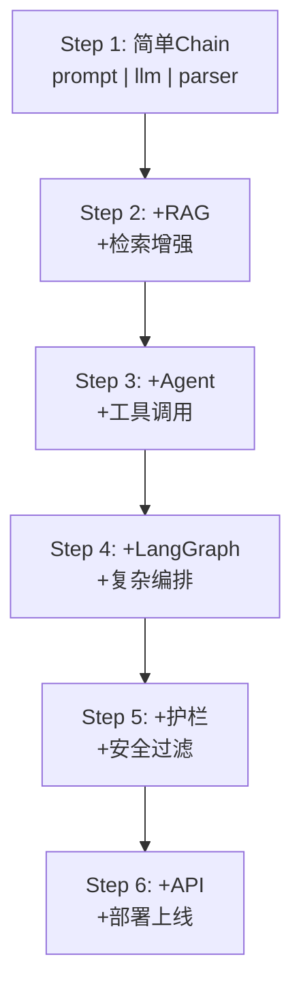
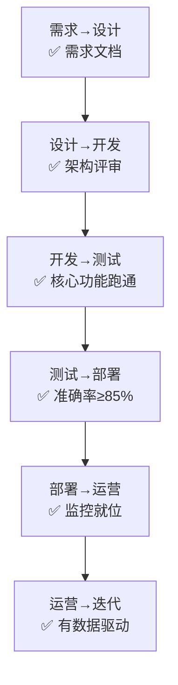
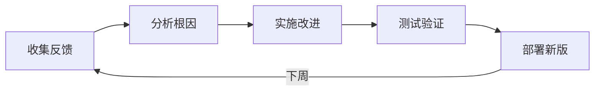

# LLM 应用全生命周期图解

> 用图解理解 LLM 应用从想法到上线的完整旅程。

---

## 一、生命周期全景

```mermaid
graph LR
    subgraph 生命周期 &#123;"LLM应用全生命周期(7阶段)"&#125;
        S1["1.需求分析<br/>场景/用户/约束"]
        S2["2.架构设计<br/>模式/模型/选型"]
        S3["3.开发实现<br/>渐进式构建"]
        S4["4.测试评估<br/>测试集/评估/基准"]
        S5["5.部署上线<br/>API/安全/监控"]
        S6["6.监控运营<br/>指标/告警/面板"]
        S7["7.反馈迭代<br/>反馈/改进/发布"]
    end

    S1 --> S2 --> S3 --> S4 --> S5 --> S6 --> S7
    S7 -.->|"循环迭代"| S3

    style S1 fill:'#C8E6C9'
    style S4 fill:'#FFF9C4'
    style S6 fill:'#E3F2FD'
    style S7 fill:'#F3E5F5'
```

## 二、需求分析

```mermaid
graph TB
    subgraph 需求分析 &#123;"需求分析五问"&#125;
        R1["用户是谁？<br/>内部/外部/开发者"]
        R2["核心场景？<br/>问答/分析/生成/审核"]
        R3["数据量级？<br/>文档数/用户数/QPS"]
        R4["质量要求？<br/>准确率/延迟/成本"]
        R5["约束条件？<br/>预算/隐私/合规"]
    end

    style 需求分析 fill:'#C8E6C9'
```

## 三、渐进式开发路径



## 四、阶段门禁



## 五、部署检查清单

```mermaid
graph TB
    subgraph 检查清单 &#123;"部署前检查"&#125;
        C1["代码: .env安全/依赖更新"]
        C2["模型: API Key/生产模型/max_tokens"]
        C3["数据: 向量库/历史持久化/清理策略"]
        C4["安全: 护栏/限流/鉴权/脱敏"]
        C5["运维: 追踪/日志/告警/降级"]
    end

    style 检查清单 fill:'#E3F2FD'
```

## 六、迭代循环


