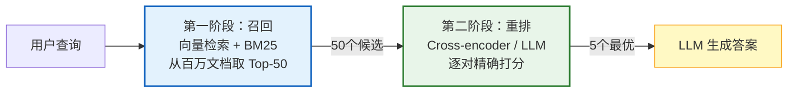

# RAG 重排序图解

> 两阶段检索：向量召回快速粗筛 Top-50 → Cross-encoder 精确重排 Top-5，兼顾速度与精度。

---



---

## 三种重排方法对比

| 方法 | 精度 | 速度 | 成本 | 适用 |
|------|------|------|------|------|
| Cross-encoder | 高 | 中 | 低 | 通用推荐 |
| LLM 重排 | 最高 | 慢 | 高 | 少量文档 |
| RRF 融合 | 中 | 快 | 低 | 多路检索 |

---

## MMR 多样性重排

```mermaid
graph TB
    C["候选文档池<br/>Top-50"] --> MMR&#123;"MMR 选择"&#125;
    MMR -->|"λ × 相关性<br/>- (1-λ) × 冗余度"| S1["选中文档1<br/>（最相关）"]
    S1 --> MMR2&#123;"MMR 选择"&#125;
    MMR2 -->|"相关性高<br/>但与已选相似度低"| S2["选中文档2<br/>（多样+相关）"]
    S2 --> MMR3&#123;"MMR 选择"&#125;
    MMR3 --> S3["选中文档3"]
    S3 --> RESULT["Top-5 结果<br/>既相关又多样"]

    style MMR fill:#E3F2FD,stroke:#1565C0,stroke-width:3px
    style RESULT fill:#E8F5E9,stroke:#2E7D32,stroke-width:2px
```

---

## 检查清单

| 检查项 | 状态 |
|--------|------|
| 有两阶段架构 | ☐ |
| 召回 Top-50+ | ☐ |
| Cross-encoder 重排 | ☐ |
| 有 NDCG 评估 | ☐ |
| MMR 多样性 | ☐ |
| 延迟 < 500ms | ☐ |
