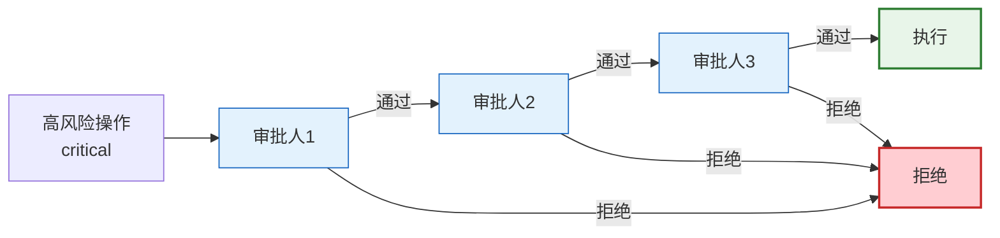

# LangGraph 中断与人机交互图解

> Agent 执行到高风险操作时暂停，等待人工审批后再继续，实现 human-in-the-loop。

---

```mermaid
graph TB
    U["用户请求"] --> P["Agent 规划"]
    P --> RC&#123;"风险检查"&#125;
    
    RC -->|低风险| AUTO["自动执行"]
    RC -->|中风险| WARN["⚠️ 警告后执行"]
    RC -->|高风险| INT["⏸️ 中断等待审批"]
    
    INT --> REVIEW&#123;"人工审核"&#125;
    REVIEW -->|批准| EXEC["继续执行"]
    REVIEW -->|修改参数| MODIFY["修改后执行"]
    REVIEW -->|拒绝| CANCEL["取消操作"]
    
    EXEC --> LOG["审计日志"]
    AUTO --> LOG
    WARN --> LOG
    CANCEL --> LOG

    style INT fill:#FFF9C4,stroke:#F9A825,stroke-width:3px
    style REVIEW fill:#FFCDD2,stroke:#C62828,stroke-width:2px
    style AUTO fill:#E8F5E9,stroke:#2E7D32
```

---

## 中断方式对比

| 方式 | 时机 | 灵活性 | 适用 |
|------|------|--------|------|
| interrupt_before | 节点前 | 固定 | 始终审批 |
| interrupt_after | 节点后 | 固定 | 执行后审核 |
| interrupt() | 动态 | 最高 | 条件审批 |

---

## 多人审批流程



---

## 检查清单

| 检查项 | 状态 |
|--------|------|
| 有风险分级 | ☐ |
| 有 interrupt 审批 | ☐ |
| 有超时自动拒绝 | ☐ |
| 有审批日志 | ☐ |
| 有多人审批 | ☐ |
| 有 Checkpointer | ☐ |
