# 回调系统图解

> 用图解理解 Callback 的事件层级和自定义用法。

---

## 一、回调在执行链中的位置

```mermaid
graph TB
    subgraph 执行链 &#123;"Chain执行 + 回调事件"&#125;
        C1["on_chain_start"] --> P["PromptTemplate"]
        P --> C2["on_llm_start"]
        C2 --> L["LLM API调用"]
        L --> C3["on_llm_end<br/>记录Token/耗时"]
        C3 --> PAR["Parser"]
        PAR --> C4["on_chain_end"]
        C4 --> R["返回结果"]
        C3 -.-> LOG["日志/监控/统计"]
    end

    style C2 fill:'#FFF9C4'
    style C3 fill:'#FFF9C4'
    style LOG fill:'#C8E6C9'
```

## 二、事件层级

```mermaid
graph TB
    subgraph 事件层级 &#123;"四类回调事件"&#125;
        L1["Chain事件<br/>on_chain_start/end"]
        L2["LLM事件<br/>on_llm_start/end/new_token"]
        L3["Tool事件<br/>on_tool_start/end"]
        L4["Retriever事件<br/>on_retriever_start/end"]
    end

    L1 --> L2 & L3 & L4

    style L2 fill:'#FFF9C4'
```

## 三、回调设置层级

```mermaid
graph TD
    G1["全局级<br/>set_llm_cache<br/>所有调用生效"] --> G2["实例级<br/>ChatOpenAI(callbacks=[...])<br/>该实例生效"]
    G2 --> G3["调用级<br/>invoke(config=&#123;callbacks:[...]&#125;)<br/>仅本次生效"]

    style G1 fill:'#FFCDD2'
    style G2 fill:'#FFF9C4'
    style G3 fill:'#C8E6C9'
```



## 四、常用自定义回调

```mermaid
graph TB
    subgraph 自定义 &#123;"四种常用自定义回调"&#125;
        H1["MetricsHandler<br/>计时+Token统计"]
        H2["StreamHandler<br/>流式输出到自定义位置"]
        H3["ToolTracer<br/>追踪Agent工具调用链"]
        H4["ErrorCapture<br/>捕获并记录所有错误"]
    end

    style H1 fill:'#C8E6C9'
    style H3 fill:'#E3F2FD'
    style H4 fill:'#FFCDD2'
```
