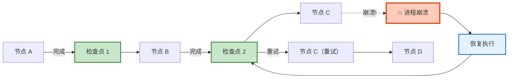
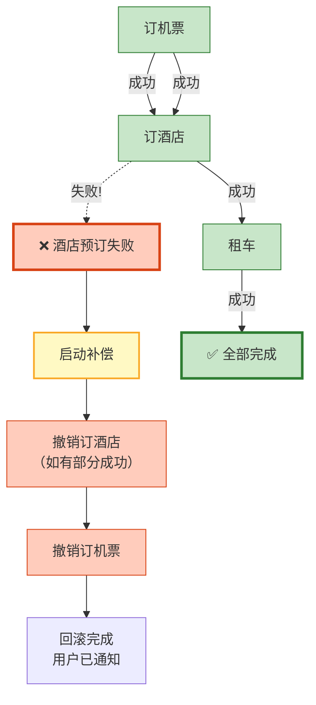
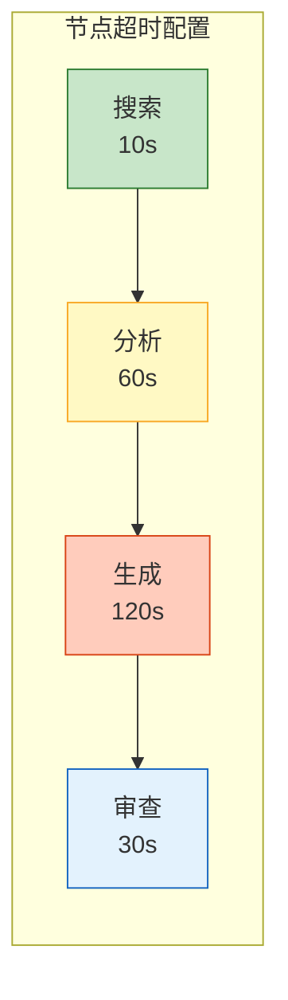
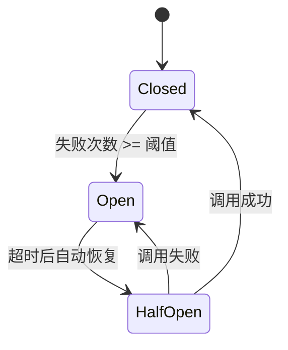

# Agent 可恢复性与容错编排图解

> Agent 运行到第 8 步崩溃——从头重来还是断点续跑？本图解可视化检查点恢复、节点降级和 Saga 补偿模式。

---

## 检查点恢复机制



---

## 节点级降级链

```mermaid
graph TB
    NODE["节点执行"] --> PRIMARY&#123;"主方案<br/>（贵模型）"&#125;
    PRIMARY -->|"成功"| OK["✅ 完成"]
    PRIMARY -->|"超时/失败"| FALLBACK&#123;"降级方案<br/>（便宜模型）"&#125;
    FALLBACK -->|"成功"| OK
    FALLBACK -->|"失败"| CACHE&#123;"缓存兜底"&#125;
    CACHE -->|"命中"| OK
    CACHE -->|"未命中"| DEFAULT["默认回复<br/>+ 标记错误"]

    style PRIMARY fill:#E3F2FD,stroke:#1565C0
    style FALLBACK fill:#FFF9C4,stroke:#F9A825
    style CACHE fill:#F3E5F5,stroke:#7B1FA2
    style OK fill:#C8E6C9,stroke:#2E7D32,stroke-width:2px
    style DEFAULT fill:#FFCCBC,stroke:#D84315
```

---

## Saga 补偿模式



---

## 超时编排



---

## 熔断器状态机



---

## 容错模式总览

| 模式 | 场景 | 核心机制 |
|------|------|----------|
| 检查点恢复 | 进程崩溃 | thread_id + Checkpointer |
| 重试退避 | API 超时 | tenacity + 指数退避 |
| 节点降级 | 主方案失败 | 降级链：贵→便宜→缓存→默认 |
| 超时控制 | 节点卡住 | asyncio.wait_for |
| 熔断保护 | 工具持续失败 | 三态熔断器 |
| Saga 补偿 | 多步事务失败 | 逆向回滚已完成步骤 |
| 状态自修复 | 状态损坏 | Schema 校验 + 默认值 |

---

## 检查清单

| 检查项 | 状态 |
|--------|------|
| 配置了 Checkpointer | ☐ |
| 实现了断点恢复 | ☐ |
| LLM 调用有重试 | ☐ |
| 工具调用有降级 | ☐ |
| 节点有超时控制 | ☐ |
| 实现了 Saga 补偿 | ☐ |
| 配置了熔断器 | ☐ |
| 状态有校验 | ☐ |
