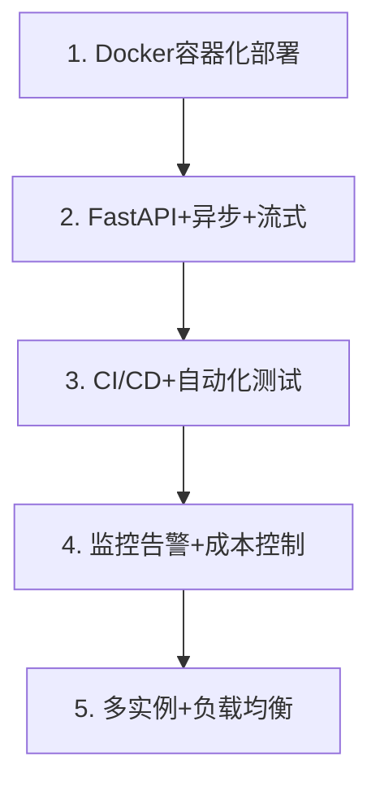
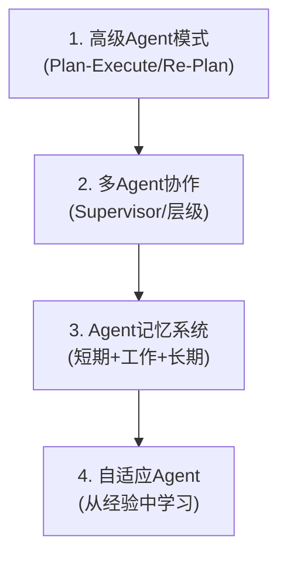
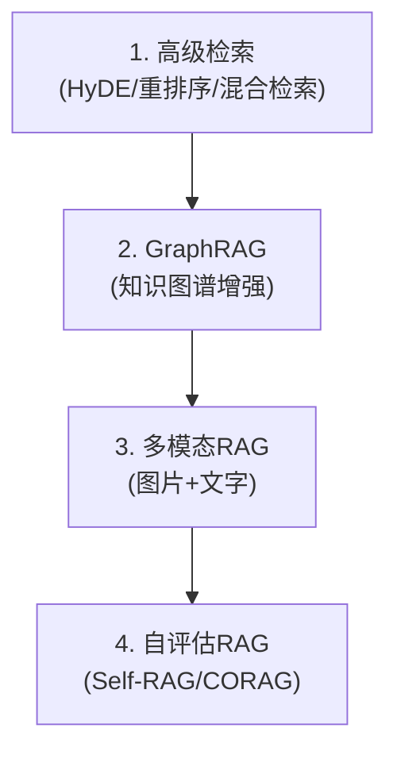
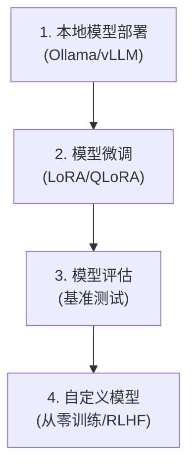
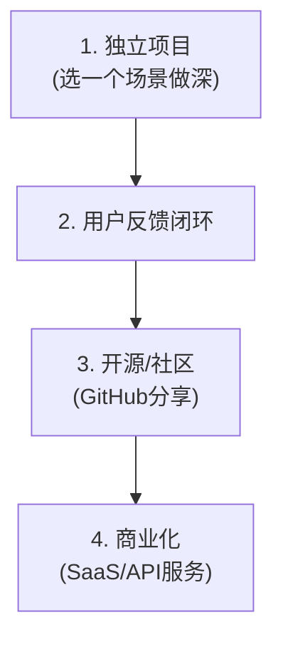

# 学习路径进阶路线图

> 学完本课程后的进阶方向。从"会用 LangChain"到"成为 LLM 应用专家"。

---

## 一、进阶路线全景

```mermaid
graph LR
    subgraph 进阶路线 &#123;"学完课程后的进阶方向"&#125;
        NOW["你现在<br/>会用LangChain+LangGraph<br/>构建应用"] --> D1["方向1: 深入工程化<br/>(部署/监控/优化)"]
        NOW --> D2["方向2: 深入Agent<br/>(高级模式/多Agent)"]
        NOW --> D3["方向3: 深入RAG<br/>(高级检索/GraphRAG)"]
        NOW --> D4["方向4: 深入模型<br/>(微调/本地部署)"]
        NOW --> D5["方向5: 做产品<br/>(完整项目/创业)"]
    end

    style NOW fill:'#C8E6C9'
    style D1 fill:'#E3F2FD'
    style D2 fill:'#FFF9C4'
    style D3 fill:'#FFE0B2'
    style D4 fill:'#F3E5F5'
    style D5 fill:'#FFCDD2'
```

## 二、各方向详细路线

### 方向1：深入工程化



### 方向2：深入Agent



### 方向3：深入RAG



### 方向4：深入模型



### 方向5：做产品



## 三、推荐学习资源

| 方向 | 资源 | 类型 |
|------|------|------|
| LangChain | python.langchain.com/docs | 官方文档 |
| LangGraph | langchain-ai.github.io/langgraph | 官方文档 |
| RAG | RAGFromScratch YouTube系列 | 视频教程 |
| Agent | LangChain Academy | 官方课程 |
| 微调 | Unsloth文档+Colab | 实践教程 |
| 评估 | RAGAS文档 | 框架文档 |
| 前沿 | arxiv.org (cs.CL) | 论文 |
| 社区 | Discord/GitHub Discussions | 交流 |

## 四、能力等级自评

```mermaid
graph TB
    subgraph 等级 &#123;"LLM应用开发能力等级"&#125;
        L1["L1 入门<br/>能调用LLM<br/>能跑通示例"]
        L2["L2 基础<br/>能用LCEL组合<br/>能做RAG"]
        L3["L3 中级<br/>能用LangGraph<br/>能做Agent<br/>能部署"]
        L4["L4 高级<br/>能设计架构<br/>能多Agent<br/>能优化"]
        L5["L5 专家<br/>能微调模型<br/>能创新<br/>能带团队"]
    end

    L1 --> L2 --> L3 --> L4 --> L5

    style L1 fill:'#C8E6C9'
    style L5 fill:'#F3E5F5'
```

| 等级 | 能力 | 对应课程 |
|------|------|---------|
| L1 | 调用LLM、跑通示例 | 00-02课 |
| L2 | LCEL组合、RAG、Memory | 03-07课 |
| L3 | LangGraph、Agent、部署 | 08-12课 |
| L4 | 架构设计、多Agent、优化 | 案例库+知识库 |
| L5 | 微调、创新、领导 | 进阶方向 |
