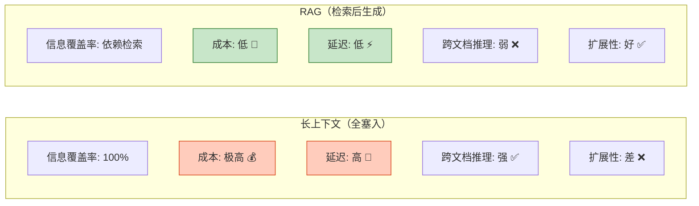
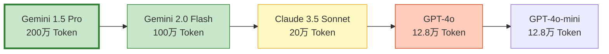
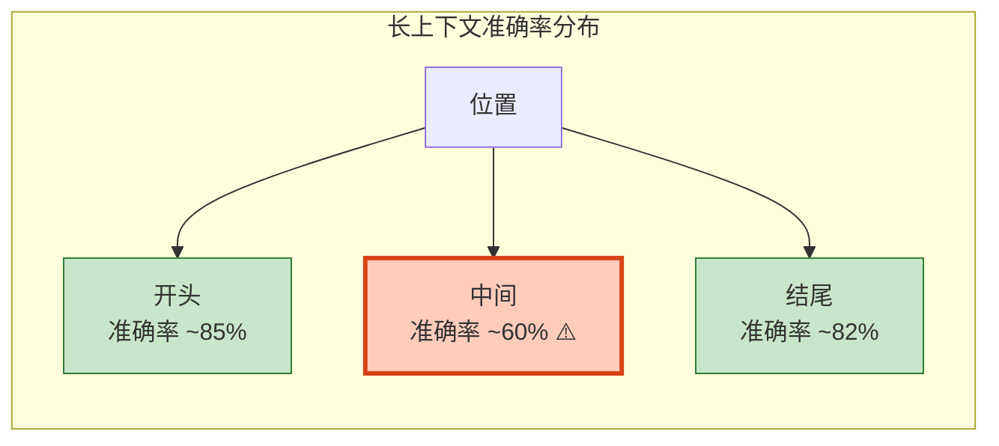

# 长上下文模型与 RAG 策略权衡图解

> 上下文窗口越来越大，RAG 还需要吗？本图解可视化长上下文 vs RAG 的成本、能力和混合策略选择。

---

## 核心问题

```mermaid
graph TB
    Q["文档库 500 篇 × 2000 字 = 100 万 Token"]
    Q --> CHOICE&#123;"选择策略"&#125;

    CHOICE --> LC["方案A：长上下文<br/>全塞入 Prompt"]
    CHOICE --> RAG["方案B：RAG<br/>检索 Top-5"]

    LC --> LC1["单次成本: $1.625<br/>1000次/天 = $1,625/天"]
    RAG --> RAG1["单次成本: $0.03<br/>1000次/天 = $30/天"]

    LC1 --> GAP["差距: 54 倍"]
    RAG1 --> GAP

    style LC fill:#FFCCBC,stroke:#D84315
    style RAG fill:#C8E6C9,stroke:#2E7D32
    style GAP fill:#FFF9C4,stroke:#F9A825,stroke-width:3px
```

---

## 能力对比



---

## 决策流程

```mermaid
graph TB
    Q["开始选择"] --> S1&#123;"文档总 Token"&#125;
    S1 -->|"< 5万"| S2&#123;"查询频率"&#125;
    S1 -->|"> 20万"| RAG["✅ RAG"]
    S1 -->|"5万-20万"| S3&#123;"需要跨文档推理?"&#125;

    S2 -->|"< 50次/天"| S4&#123;"需要跨文档推理?"&#125;
    S2 -->|"> 50次/天"| RAG

    S4 -->|"是"| LC["✅ 长上下文"]
    S4 -->|"否"| RAG

    S3 -->|"是"| HYBRID["✅ 混合策略"]
    S3 -->|"否"| RAG

    style LC fill:#C8E6C9,stroke:#2E7D32,stroke-width:2px
    style RAG fill:#E3F2FD,stroke:#1565C0,stroke-width:2px
    style HYBRID fill:#FFF9C4,stroke:#F9A825,stroke-width:2px
```

---

## 混合策略架构

```mermaid
graph TB
    Q["用户提问"] --> RET["RAG 检索 Top-10<br/>（粗筛）"]
    RET --> MERGE["拼接完整文档<br/>（不截断）"]
    MERGE --> CHECK&#123;"Token 数 < 上限?"&#125;
    CHECK -->|"是"| LONG["长上下文模型精读<br/>Gemini 1.5 Pro"]
    CHECK -->|"否"| TRUNC["截断到上限"]
    TRUNC --> LONG
    LONG --> GEN["生成回答<br/>+ 引用溯源"]

    style RET fill:#E3F2FD,stroke:#1565C0
    style LONG fill:#F3E5F5,stroke:#7B1FA2,stroke-width:2px
    style GEN fill:#C8E6C9,stroke:#2E7D32
```

---

## 主流模型上下文窗口



---

## "中间遗忘"效应



---

## 场景决策速查

| 场景 | 文档量 | 查询频率 | 跨文档 | 推荐策略 |
|------|--------|----------|--------|----------|
| 法律合同审查 | 4万 Token | 低 | 否 | 长上下文 |
| 客服知识库 | 500万 Token | 5000次/天 | 否 | RAG |
| 研究论文对比 | 40万 Token | 50次/天 | 是 | 混合 |
| 代码库问答 | 200万 Token | 高 | 有时 | RAG |
| 小型FAQ | 2万 Token | 低 | 否 | 长上下文 |
| 企业知识库 | 100万+ | 高 | 是 | RAG + 混合 |

---

## 检查清单

| 检查项 | 状态 |
|--------|------|
| 理解长上下文成本模型 | ☐ |
| 能计算两种方案成本对比 | ☐ |
| 知道"中间遗忘"陷阱 | ☐ |
| 有策略选择决策框架 | ☐ |
| 理解混合策略 | ☐ |
| 知道 Prompt Caching 优化 | ☐ |
| 能针对场景选择方案 | ☐ |
