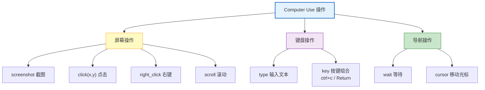
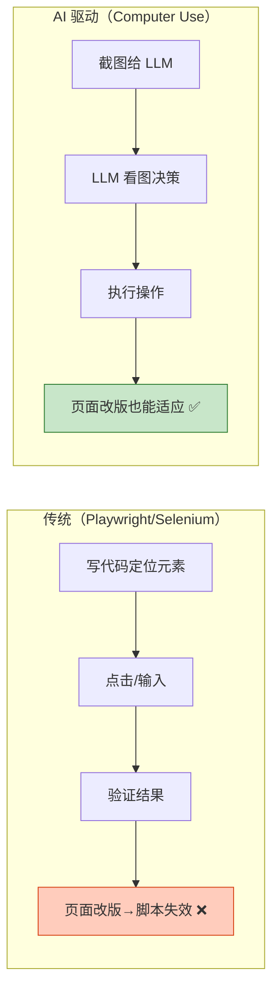

# Computer Use 与浏览器自动化 Agent 图解

> AI 看屏幕、移鼠标、点按钮——像人一样操作电脑。本图解可视化 Computer Use 的核心循环、安全策略和方案对比。

---

## 工作循环

```mermaid
graph LR
    A["📸 截取屏幕"] --> B["🧠 LLM 分析截图<br/>理解页面内容"]
    B --> C["🎯 决定操作<br/>点击/输入/滚动"]
    C --> D["⚡ 执行操作"]
    D --> E&#123;"任务完成?"&#125;
    E -->|"否"| A
    E -->|"是"| F["✅ 返回结果"]

    style B fill:#F3E5F5,stroke:#7B1FA2,stroke-width:3px
    style A fill:#E3F2FD,stroke:#1565C0
    style D fill:#C8E6C9,stroke:#2E7D32
```

---

## 操作类型



---

## 传统自动化 vs AI 驱动



---

## 方案对比

| 方案 | 速度 | 成本 | 适应性 | 安全 |
|------|------|------|--------|------|
| Anthropic Computer Use | 慢(4s/步) | 高 | 极强 | 需沙箱 |
| Playwright + LLM | 中 | 中 | 中 | 较好 |
| Browser Use(开源) | 中 | 中 | 强 | 一般 |
| 纯 Playwright | 快 | 低 | 弱 | 好 |

---

## 安全策略

```mermaid
graph LR
    REQ["操作请求"] --> URL&#123;"URL 白名单"&#125;
    URL -->|"通过"| INPUT&#123;"输入审计"&#125;
    URL -->|"拒绝"| BLOCK1["⛔ 拒绝"]
    INPUT -->|"安全"| EXEC["✅ 执行"]
    INPUT -->|"敏感"| BLOCK2["⛔ 拦截"]

    style URL fill:#FFCCBC,stroke:#D84315
    style INPUT fill:#FFF9C4,stroke:#F9A825
    style EXEC fill:#C8E6C9,stroke:#2E7D32
```

---

## 检查清单

| 检查项 | 状态 |
|--------|------|
| 理解 Computer Use 工作循环 | ☐ |
| 能调用 Computer Use API | ☐ |
| 理解操作类型 | ☐ |
| Playwright 集成 | ☐ |
| 安全策略配置 | ☐ |
| 成本模型理解 | ☐ |
