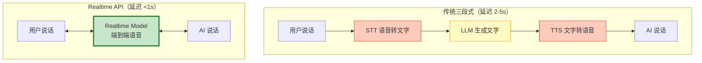
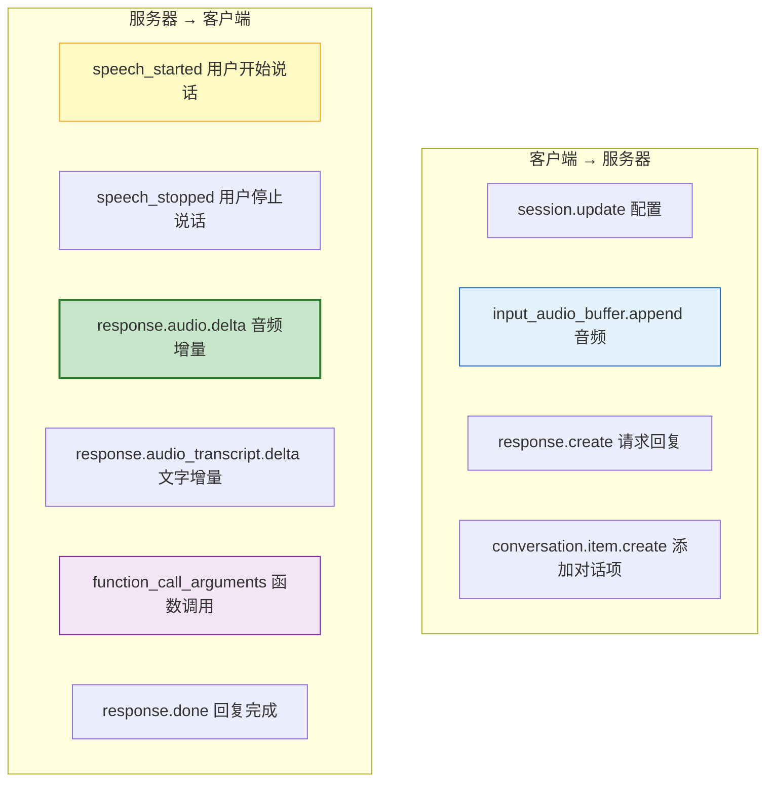

# OpenAI Realtime API 与语音 Agent 图解

> 语音输入直接到语音输出，端到端延迟不到 1 秒。本图解可视化 Realtime API 架构、事件流和打断处理。

---

## 三段式 vs Realtime



---

## 事件驱动模型



---

## 打断处理

```mermaid
graph TB
    AI["AI 正在说话"] --> LISTEN["VAD 检测用户声音"]
    LISTEN --> DETECT&#123;"用户开始说话?"&#125;
    DETECT -->|"是"| CANCEL["取消当前回复<br/>response.cancel"]
    CANCEL --> CLEAR["清空音频队列"]
    CLEAR --> LISTEN2["等待用户说完"]
    DETECT -->|"否"| CONTINUE["继续播放"]
    LISTEN2 --> PROCESS["处理新输入"]

    style CANCEL fill:#FFCCBC,stroke:#D84315,stroke-width:2px
    style PROCESS fill:#C8E6C9,stroke:#2E7D32
```

---

## 方案对比

| 方案 | 延迟 | 中文支持 | 成本/分钟 | 离线 |
|------|------|---------|----------|------|
| OpenAI Realtime | <1s | 好 | $1.4 | ❌ |
| 讯飞+LLM+讯飞TTS | 1-2s | 极好 | ¥0.05 | ❌ |
| Whisper+LLM+Coqui | 2-4s | 好 | ¥0 | ✅ |
| Deepgram+LLM+ElevenLabs | 1-2s | 中 | $0.3 | ❌ |

---

## 检查清单

| 检查项 | 状态 |
|--------|------|
| 理解 Realtime vs 三段式 | ☐ |
| 知道事件驱动模型 | ☐ |
| 能配置会话参数 | ☐ |
| 处理打断逻辑 | ☐ |
| LangGraph 集成函数调用 | ☐ |
| 成本模型理解 | ☐ |
