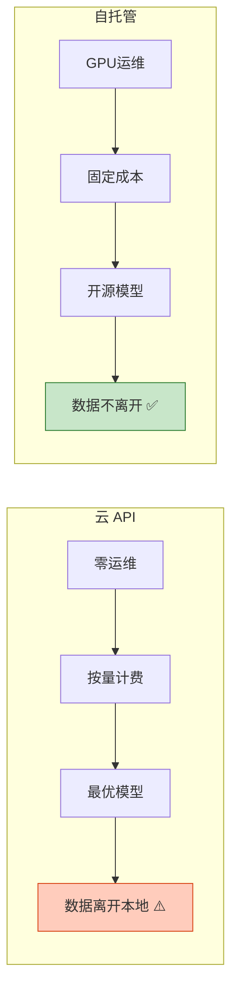
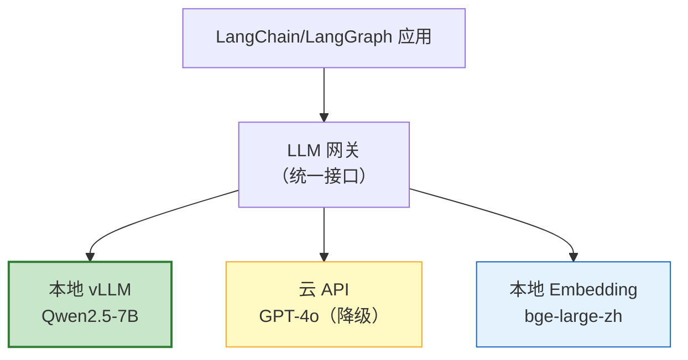
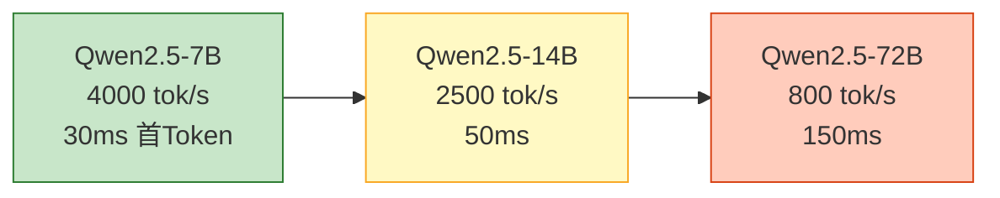

# 自托管 LLM 与本地推理部署图解

> 数据不出内网、成本可控、延迟极低——自托管 LLM 的核心价值。本图解可视化推理引擎选型、部署架构和性能基准。

---

## 引擎选型决策树

```mermaid
graph TB
    START["选择推理引擎"] --> GPU&#123;"有 GPU?"&#125;
    GPU -->|"有"| PROD&#123;"生产环境?"&#125;
    GPU -->|"无"| MEM&#123;"内存 >16GB?"&#125;

    PROD -->|"是"| VLLM["vLLM<br/>高吞吐+OpenAI兼容"]
    PROD -->|"否"| OLLAMA1["Ollama<br/>简单易用"]

    MEM -->|"是"| OLLAMA2["Ollama<br/>CPU模式"]
    MEM -->|"否"| LLAMACPP["llama.cpp<br/>极致轻量"]

    VLLM --> NVIDIA&#123;"NVIDIA GPU?"&#125;
    NVIDIA -->|"是"| TRT["TensorRT-LLM<br/>极致性能"]

    style VLLM fill:#C8E6C9,stroke:#2E7D32,stroke-width:2px
    style OLLAMA1 fill:#E3F2FD,stroke:#1565C0
    style OLLAMA2 fill:#E3F2FD,stroke:#1565C0
    style LLAMACPP fill:#FFF9C4,stroke:#F9A825
    style TRT fill:#F3E5F5,stroke:#7B1FA2
```

---

## 云 API vs 自托管



---

## 部署架构



---

## 性能基准（单卡 A100 80GB）



---

## 开源模型推荐

| 模型 | 参数 | 中文 | 工具调用 | 量化后显存 |
|------|------|------|---------|-----------|
| Qwen2.5-7B | 7B | ★★★★★ | ✅ | 5GB |
| Qwen2.5-14B | 14B | ★★★★★ | ✅ | 9GB |
| Qwen2.5-72B | 72B | ★★★★★ | ✅ | 38GB |
| Llama-3.1-8B | 8B | ★★★☆ | ✅ | 6GB |
| DeepSeek-R1-7B | 7B | ★★★★ | 有限 | 5GB |

---

## 混合部署策略

```mermaid
graph TB
    Q["用户请求"] --> PRIV&#123;"隐私敏感?"&#125;
    PRIV -->|"是"| LOCAL["本地模型<br/>数据不离开"]
    PRIV -->|"否"| COMPLEX&#123;"复杂任务?"&#125;
    COMPLEX -->|"是"| CLOUD["云端模型<br/>高质量"]
    COMPLEX -->|"否"| LOCAL

    style LOCAL fill:#C8E6C9,stroke:#2E7D32,stroke-width:2px
    style CLOUD fill:#FFF9C4,stroke:#F9A825
```

---

## 检查清单

| 检查项 | 状态 |
|--------|------|
| 理解自托管驱动力 | ☐ |
| 能区分引擎选型 | ☐ |
| vLLM 部署 | ☐ |
| Ollama 快速部署 | ☐ |
| LangChain 集成本地模型 | ☐ |
| 完全本地化 LangGraph Agent | ☐ |
| 量化部署 | ☐ |
| 混合路由 | ☐ |
