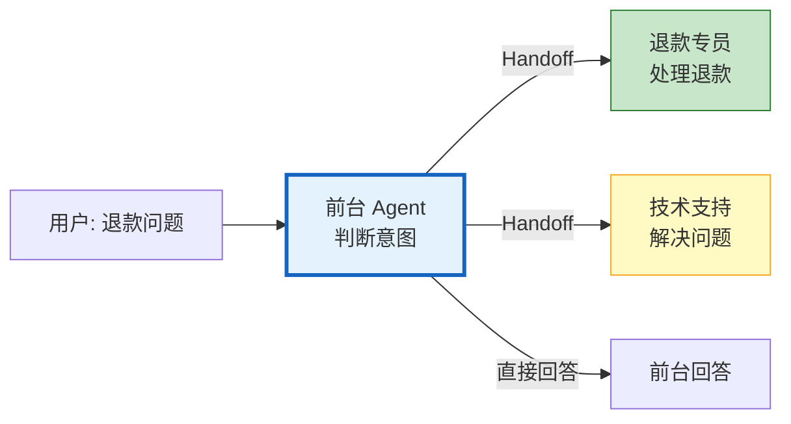
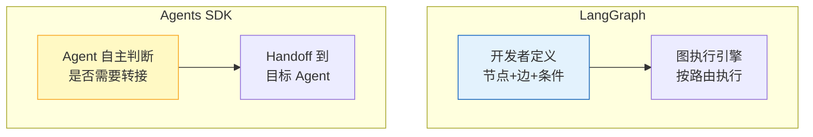

# OpenAI Agents SDK 与多 Agent 框架图解

> 四大 Agent 框架怎么选？Handoff 机制怎么运作？本图解可视化框架对比和核心机制。

---

## 四大框架定位

```mermaid
graph TB
    Q["选型决策"] --> CTRL&#123;"需要精确控制?"&#125;
    CTRL -->|"是"| LG["LangGraph<br/>状态图+条件路由<br/>精确控制每步"]
    CTRL -->|"否"| OAI&#123;"OpenAI 生态?"&#125;
    OAI -->|"是"| SDK["Agents SDK<br/>Handoff转接<br/>快速搭建"]
    OAI -->|"否"| MODE&#123;"协作模式?"&#125;
    MODE -->|"角色分工"| CREW["CrewAI<br/>角色+任务委派"]
    MODE -->|"对话式"| AUTO["AutoGen<br/>多轮对话+GroupChat"]

    style LG fill:#E3F2FD,stroke:#1565C0,stroke-width:2px
    style SDK fill:#FFF9C4,stroke:#F9A825,stroke-width:2px
    style CREW fill:#C8E6C9,stroke:#2E7D32
    style AUTO fill:#F3E5F5,stroke:#7B1FA2
```

---

## Handoff 机制



---

## LangGraph vs Agents SDK



---

## 框架对比

| 维度 | LangGraph | Agents SDK | CrewAI | AutoGen |
|------|-----------|------------|--------|---------|
| 核心模式 | 状态图 | Handoff | 角色分工 | 对话式 |
| 控制精度 | ★★★★★ | ★★★☆ | ★★★☆ | ★★★☆ |
| 快速上手 | ★★★☆ | ★★★★★ | ★★★★ | ★★★☆ |
| 模型支持 | 任意 | OpenAI为主 | 任意 | 任意 |
| 生产就绪 | ★★★★★ | ★★★☆ | ★★★★ | ★★★☆ |

---

## 检查清单

| 检查项 | 状态 |
|--------|------|
| 理解四大框架定位 | ☐ |
| 能创建 Agents SDK Agent | ☐ |
| 理解 Handoff 机制 | ☐ |
| 知道何时选哪个框架 | ☐ |
