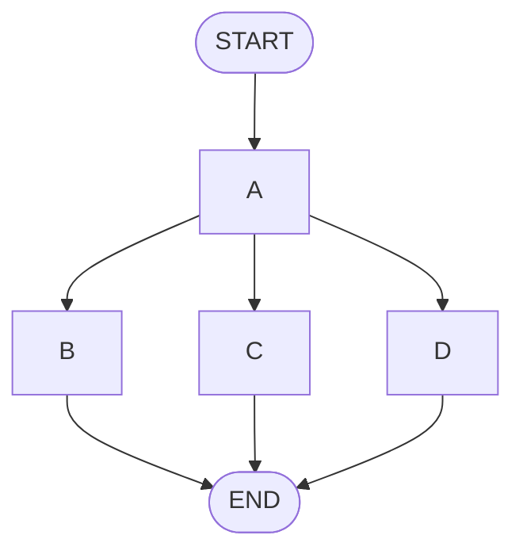
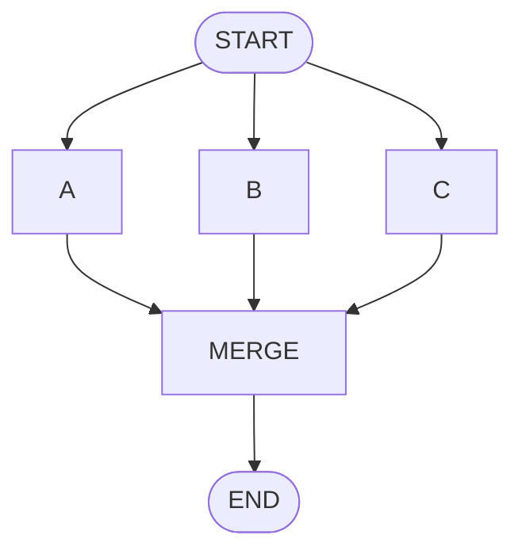
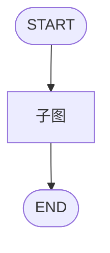
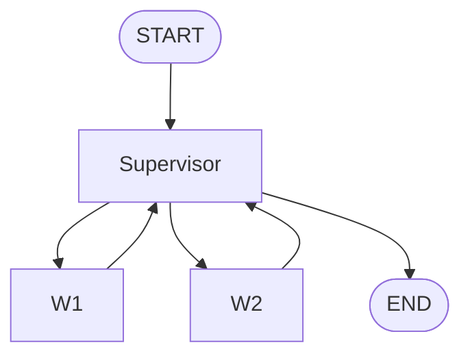

# 状态机设计模式图解

> 用图解理解 LangGraph 的六种状态机模式。

---

## 一、六种状态机模式

```mermaid
graph TB
    subgraph 六种模式 &#123;"LangGraph 六种状态机模式"&#125;
        M1["1.线性<br/>A→B→C"]
        M2["2.分支<br/>A→B or C or D"]
        M3["3.循环<br/>A→B→A(重试)"]
        M4["4.并行<br/>A→(B,C,D)→合并"]
        M5["5.嵌套<br/>A→子图→B"]
        M6["6.Supervisor<br/>主控↔Workers"]
    end

    style M1 fill:'#C8E6C9'
    style M3 fill:'#FFF9C4'
    style M6 fill:'#FFE0B2'
```

## 二、各模式示意

### 线性


### 分支


### 循环
```mermaid
graph TB
    S([START]) --> GEN --> CHECK&#123;"通过?"&#125;
    CHECK -->|"否"| GEN
    CHECK -->|"是"| E([END])
    style S fill:'#4CAF50,color:#fff'
    style E fill:'#4CAF50,color:#fff'
```

### 并行


### 嵌套


### Supervisor


## 三、状态转移表

| 当前状态 | 条件 | 目标状态 |
|---------|------|---------|
| idle | 用户输入 | classify |
| classify | 知识查询 | retrieve |
| classify | 闲聊 | chat |
| retrieve | 找到 | generate |
| retrieve | 未找到 | fallback |
| generate | 成功 | output |
| generate | 失败×3 | fallback |

## 四、选择决策

```mermaid
graph TD
    Q&#123;"任务?"&#125;
    Q -->|"固定步骤"| LINEAR["线性"]
    Q -->|"多种类型"| BRANCH["分支"]
    Q -->|"需要重试"| LOOP["循环"]
    Q -->|"可并行"| PAR["并行"]
    Q -->|"模块化"| NEST["嵌套"]
    Q -->|"需调度"| SUP["Supervisor"]

    style LOOP fill:'#C8E6C9'
```
