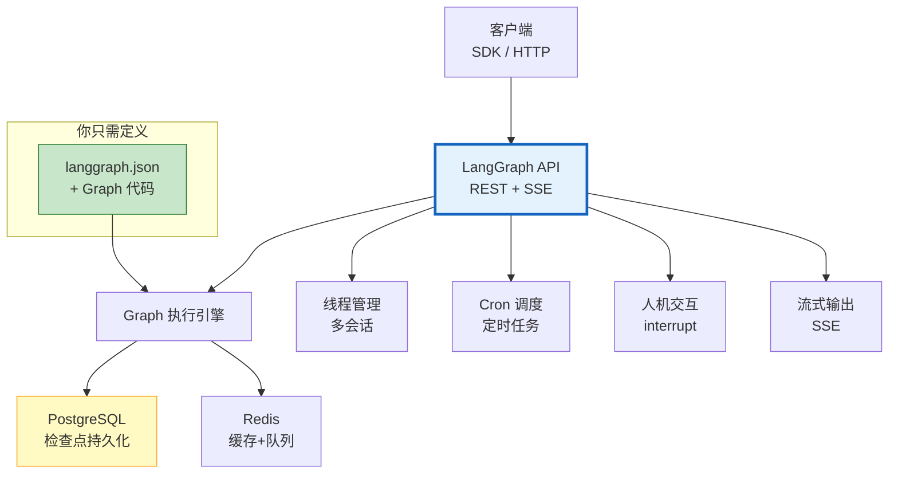
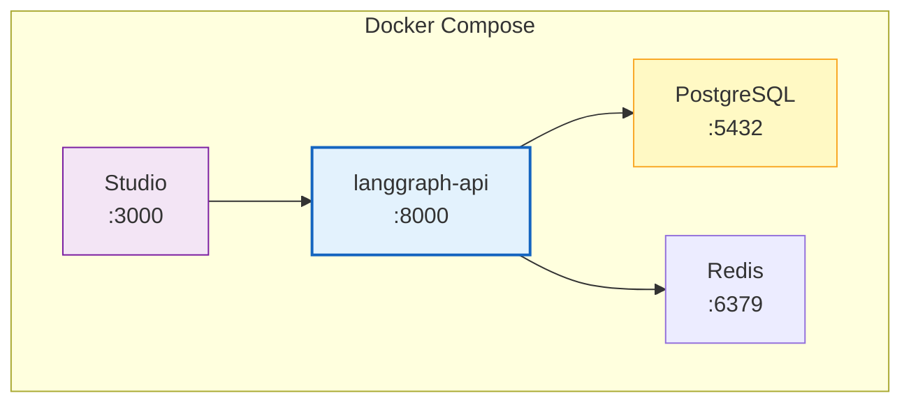
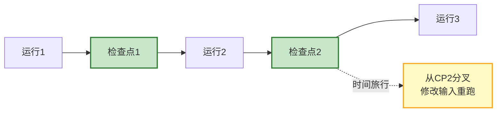

# LangGraph Platform 部署与生产化图解

> 从本地 Agent 到生产服务只需一个配置文件。本图解可视化 LangGraph Platform 架构、部署方式和核心能力。

---

## 三种部署方式

```mermaid
graph TB
    Q["选择部署方式"] --> CLOUD&#123;"免运维?"&#125;
    CLOUD -->|"是"| LG_CLOUD["LangGraph Cloud<br/>官方托管<br/>快速上线"]
    CLOUD -->|"否"| PRIV&#123;"数据隐私?"&#125;
    PRIV -->|"是"| SELF["自托管 Docker<br/>私有云部署<br/>数据不离开"]
    PRIV -->|"否"| CLOUD
    SELF --> STUDIO["LangGraph Studio<br/>本地可视化调试"]

    style LG_CLOUD fill:#E3F2FD,stroke:#1565C0,stroke-width:2px
    style SELF fill:#C8E6C9,stroke:#2E7D32,stroke-width:2px
    style STUDIO fill:#F3E5F5,stroke:#7B1FA2
```

---

## Platform 架构



---

## Platform 提供的能力

| 能力 | 说明 |
|------|------|
| REST API | 自动生成 |
| 流式输出 | SSE 原生 |
| 持久化 | 自动检查点 |
| 状态恢复 | 断点续跑 |
| Cron 调度 | 定时任务 |
| 人机交互 | interrupt 暂停 |
| Studio | 可视化调试 |
| 多线程 | 会话管理 |

---

## Docker 部署架构



---

## 持久化与时间旅行



---

## 人机交互流程

```mermaid
graph TB
    START["启动运行"] --> DRAFT["生成草稿"]
    DRAFT --> INT["⏸️ interrupt<br/>暂停等待审批"]
    INT --> WAIT&#123;"等待人工"&#125;
    WAIT -->|"批准"| RESUME["恢复执行"]
    WAIT -->|"拒绝"| REJECT["结束"]
    RESUME --> PUBLISH["发布结果"]

    style INT fill:#FFCCBC,stroke:#D84315,stroke-width:3px
    style RESUME fill:#C8E6C9,stroke:#2E7D32
```

---

## 检查清单

| 检查项 | 状态 |
|--------|------|
| 理解三种部署方式 | ☐ |
| 能写 langgraph.json 配置 | ☐ |
| Cloud 部署 | ☐ |
| Docker 自托管 | ☐ |
| 持久化与状态恢复 | ☐ |
| Cron 定时任务 | ☐ |
| 人机交互 interrupt | ☐ |
| Studio 可视化调试 | ☐ |
| 生产化检查清单 | ☐ |
