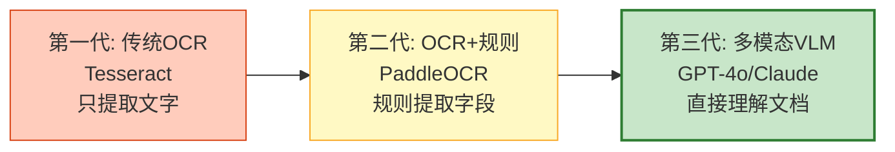

# 多模态文档智能与 OCR Agent 图解

> 从 Tesseract 到 GPT-4o Vision，文档智能三代演进。本图解可视化 OCR+VLM 混合方案和文档处理 Agent 流程。

---

## 三代技术演进



---

## OCR+VLM 混合方案

```mermaid
graph TB
    IMG["文档图片"] --> OCR["OCR 快速提取<br/>PaddleOCR<br/>便宜、快"]
    OCR --> CONF&#123;"置信度?"&#125;
    CONF -->|"高 (>0.8)"| DONE["✅ 完成<br/>OCR 足够"]
    CONF -->|"低 (<0.8)"| VLM["VLM 深度理解<br/>GPT-4o<br/>贵但精准"]
    VLM --> MERGE["合并结果"]
    DONE --> MERGE

    style OCR fill:#C8E6C9,stroke:#2E7D32
    style VLM fill:#FFF9C4,stroke:#F9A825,stroke-width:2px
    style MERGE fill:#E3F2FD,stroke:#1565C0
```

---

## 文档处理 Agent 流程

```mermaid
graph TB
    FILE["输入文件"] --> DETECT&#123;"文件类型?"&#125;
    DETECT -->|"PDF"| PDF["PDF处理<br/>PyMuPDF<br/>逐页提取"]
    DETECT -->|"图片"| IMG["图片处理"]
    DETECT -->|"扫描件"| SCAN["扫描件<br/>渲染→OCR"]

    PDF --> OCR_N["OCR提取"]
    IMG --> OCR_N
    SCAN --> OCR_N

    OCR_N --> NEEDS_VLM&#123;"需要VLM?"&#125;
    NEEDS_VLM -->|"是"| VLM_N["VLM理解<br/>结构化提取"]
    NEEDS_VLM -->|"否"| STRUCT["结构化"]
    VLM_N --> STRUCT
    STRUCT --> SUM["生成摘要"]
    SUM --> OUT["输出结果"]

    style DETECT fill:#E3F2FD,stroke:#1565C0,stroke-width:2px
    style VLM_N fill:#F3E5F5,stroke:#7B1FA2
    style OUT fill:#C8E6C9,stroke:#2E7D32
```

---

## 方案成本对比

| 方案 | 单页成本 | 耗时 | 准确率 |
|------|---------|------|--------|
| PaddleOCR | ¥0 | 0.5s | ~85% |
| 讯飞OCR | ¥0.01 | 1s | ~95% |
| GPT-4o Vision | $0.01 | 3-5s | ~98% |
| 混合方案 | $0.005 | 2-3s | ~95% |

---

## 检查清单

| 检查项 | 状态 |
|--------|------|
| 理解三代技术演进 | ☐ |
| PaddleOCR 使用 | ☐ |
| GPT-4o Vision 理解文档 | ☐ |
| OCR+VLM 混合方案 | ☐ |
| LangGraph 文档Agent | ☐ |
| PDF 多页处理 | ☐ |
| 表格提取 | ☐ |
