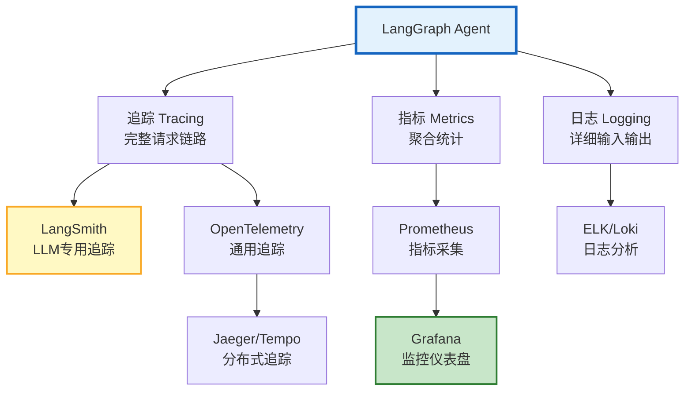
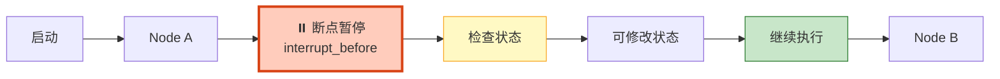

# Agent 调试与可观测工具链图解

> Agent 跑 20 步出错了，哪一步出的问题？本图解可视化追踪、指标、日志三支柱和完整工具链。

---

## 可观测三支柱



---

## 调试方法论

```mermaid
graph TB
    ISSUE["Agent 出问题"] --> TYPE&#123;"问题类型?"&#125;

    TYPE -->|"不调工具"| P1["检查模型支持<br/>检查工具描述<br/>检查system prompt"]
    TYPE -->|"调错工具"| P2["检查工具描述区分度<br/>添加few-shot<br/>换更强模型"]
    TYPE -->|"陷入循环"| P3["检查recursion_limit<br/>检查路由条件<br/>添加循环检测"]
    TYPE -->|"Token爆炸"| P4["分析Token消耗<br/>截断工具结果<br/>压缩历史"]

    style ISSUE fill:#FFCCBC,stroke:#D84315,stroke-width:2px
    style P1 fill:#E3F2FD,stroke:#1565C0
    style P2 fill:#FFF9C4,stroke:#F9A825
    style P3 fill:#F3E5F5,stroke:#7B1FA2
    style P4 fill:#C8E6C9,stroke:#2E7D32
```

---

## 断点调试



---

## 关键指标与告警

| 指标 | 正常 | 告警 | 严重 |
|------|------|------|------|
| 错误率 | <5% | 5-15% | >15% |
| P95延迟 | <30s | 30-60s | >60s |
| 平均Token | <5K | 5-10K | >10K |
| 循环检测率 | <2% | 2-5% | >5% |

---

## 工具选型

| 工具 | 用途 | 阶段 |
|------|------|------|
| LangSmith | LLM追踪 | 开发+生产 |
| OpenLLMetry | 自动注入OTel | 开发+生产 |
| Jaeger/Tempo | 分布式追踪 | 生产 |
| Prometheus | 指标采集 | 生产 |
| Grafana | 可视化 | 生产 |

---

## 检查清单

| 检查项 | 状态 |
|--------|------|
| LangSmith 自动追踪 | ☐ |
| OpenTelemetry 集成 | ☐ |
| 结构化日志 | ☐ |
| 断点调试 | ☐ |
| 单步执行 | ☐ |
| Prometheus 指标 | ☐ |
| Grafana 仪表盘 | ☐ |
| 告警规则 | ☐ |
