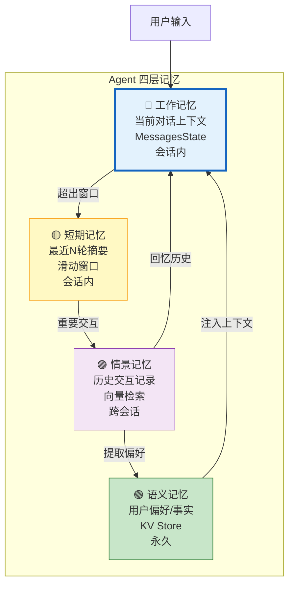

# Agent 记忆架构与长期记忆系统图解

> 工作记忆、短期记忆、情景记忆、语义记忆——Agent 的四层记忆系统仿照人脑设计。本图解可视化记忆流转和遗忘机制。

---

## 四层记忆架构



---

## 记忆流转

```mermaid
graph LR
    CHAT["用户对话"] --> WM["工作记忆<br/>保存当前消息"]
    WM --> CHECK&#123;"超出Token预算?"&#125;
    CHECK -->|"是"| COMPRESS["压缩/摘要"]
    CHECK -->|"否"| KEEP["保留"]
    COMPRESS --> SM["短期记忆<br/>保留摘要"]

    IMPORTANT&#123;"重要交互?"&#125;
    SM --> IMPORTANT
    IMPORTANT -->|"是"| STORE_EP["存入情景记忆<br/>向量化"]
    IMPORTANT -->|"否"| FORGET["可能遗忘"]

    STORE_EP --> EXTRACT["提取偏好"]
    EXTRACT --> SEM["语义记忆<br/>用户偏好"]

    style WM fill:#E3F2FD,stroke:#1565C0
    style STORE_EP fill:#F3E5F5,stroke:#7B1FA2,stroke-width:2px
    style SEM fill:#C8E6C9,stroke:#2E7D32,stroke-width:2px
```

---

## 对话中的记忆注入

```mermaid
graph TB
    Q["用户提问"] --> RECALL["回忆阶段"]
    RECALL --> EP["情景记忆检索<br/>相关历史交互"]
    RECALL -> PREF["语义记忆<br/>用户偏好"]

    EP --> CTX["构建增强上下文"]
    PREF --> CTX
    CTX --> LLM["LLM 回答"]
    LLM --> SAVE["存储阶段"]
    SAVE --> STORE_EP["存入情景记忆"]
    SAVE --> STORE_PREF["提取/更新偏好"]

    style RECALL fill:#E3F2FD,stroke:#1565C0,stroke-width:2px
    style SAVE fill:#C8E6C9,stroke:#2E7D32,stroke-width:2px
```

---

## 遗忘策略

```mermaid
graph TB
    MEM["记忆项"] --> RULE&#123;"遗忘规则"&#125;
    RULE -->|">90天"| AGE["过期遗忘"]
    RULE -->|"重要性<0.3"| LOW["低重要性遗忘"]
    RULE -->|"访问<2次 且 >30天"| COLD["冷数据遗忘"]
    RULE -->|"相似度>0.85"| MERGE["合并巩固"]

    style AGE fill:#FFCCBC,stroke:#D84315
    style LOW fill:#FFCCBC,stroke:#D84315
    style COLD fill:#FFF9C4,stroke:#F9A825
    style MERGE fill:#E3F2FD,stroke:#1565C0
```

---

## 各层记忆对比

| 层级 | 存储 | 容量 | 检索 | 更新 |
|------|------|------|------|------|
| 工作记忆 | 内存 | 当前会话 | 直接 | 每次交互 |
| 短期记忆 | 内存 | 最近N轮 | 滑动窗口 | 每轮 |
| 情景记忆 | 向量库 | 无限 | 语义检索 | 重要交互 |
| 语义记忆 | KV Store | 无限 | Key查找 | 偏好变化 |

---

## 检查清单

| 检查项 | 状态 |
|--------|------|
| 理解四层记忆架构 | ☐ |
| 滑动窗口短期记忆 | ☐ |
| Token感知裁剪 | ☐ |
| 情景记忆（向量检索） | ☐ |
| 语义记忆（偏好存储） | ☐ |
| LangGraph Store | ☐ |
| 自动偏好提取 | ☐ |
| 记忆遗忘/巩固 | ☐ |
| PostgresStore 持久化 | ☐ |
