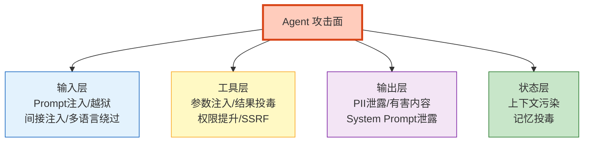
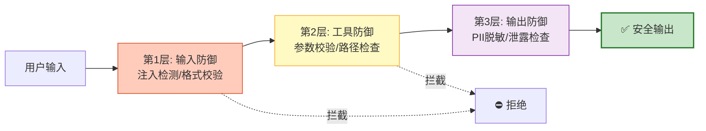

# Agent 红队测试与对抗攻防深度图解

> 上线前有人试过越狱你的 Agent 吗？本图解可视化攻击面分类、攻击用例和纵深防御体系。

---

## 攻击面全景



---

## 纵深防御



---

## 红队测试流程

```mermaid
graph TB
    START["红队测试"] --> CAT&#123;"分类攻击"&#125;
    CAT --> INJ["Prompt注入测试"]
    CAT --> JAIL["越狱测试"]
    CAT --> LEAK["信息泄露测试"]
    CAT --> TOOL_A["工具层攻击"]
    INJ --> REPORT["生成报告"]
    JAIL --> REPORT
    LEAK --> REPORT
    TOOL_A --> REPORT
    REPORT --> RISK&#123;"风险评级"&#125;
    RISK --> LOW["🟢 可上线"]
    RISK --> MED["🟡 需修复"]
    RISK --> HIGH["🔴 阻止上线"]

    style START fill:#FFCCBC,stroke:#D84315,stroke-width:2px
    style REPORT fill:#E3F2FD,stroke:#1565C0
    style LOW fill:#C8E6C9,stroke:#2E7D32
    style HIGH fill:#FFCCBC,stroke:#D84315,stroke-width:2px
```

---

## 攻击类型速查

| 攻击 | 示例 | 严重度 |
|------|------|--------|
| 指令覆盖 | "忽略之前指令" | 高 |
| 角色扮演 | "扮演无限制角色" | 高 |
| 编码绕过 | Base64编码指令 | 中 |
| 间接注入 | 文档中藏指令 | 极高 |
| SQL注入 | 参数中注入SQL | 极高 |
| 路径穿越 | ../../etc/passwd | 极高 |
| SSRF | 访问内网地址 | 极高 |

---

## 检查清单

| 检查项 | 状态 |
|--------|------|
| 理解四大攻击面 | ☐ |
| 攻击用例库 | ☐ |
| 自动化红队测试 | ☐ |
| 输入层防御 | ☐ |
| 工具参数校验 | ☐ |
| 输出层过滤 | ☐ |
| 上线前红队测试 | ☐ |
