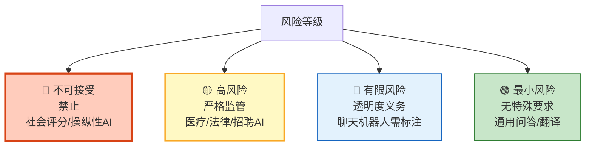
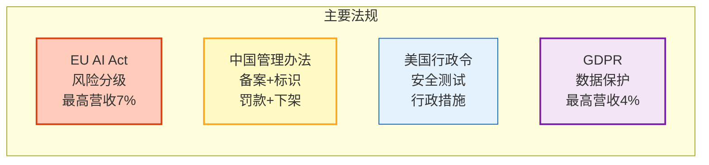
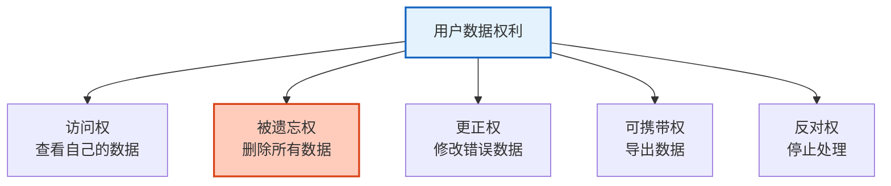

# LLM 应用合规与法律框架图解

> 你的 Agent 合法吗？本图解可视化全球 AI 法规、风险分级和合规工程化方案。

---

## EU AI Act 风险分级



---

## 全球法规对比



---

## 合规工程化

```mermaid
graph TB
    INPUT["用户请求"] --> RISK["风险评估节点<br/>判定风险等级"]
    RISK --> HIGH&#123;"高风险?"&#125;
    HIGH -->|"是"| HUMAN["人工审核"]
    HIGH -->|"否"| AGENT["Agent处理"]
    AGENT --> LABEL["输出标识<br/>AI生成水印"]
    LABEL --> LOG["数据处理日志"]
    LOG --> OUT["返回用户"]

    style RISK fill:#FFF9C4,stroke:#F9A825,stroke-width:2px
    style HUMAN fill:#FFCCBC,stroke:#D84315
    style LABEL fill:#E3F2FD,stroke:#1565C0
    style OUT fill:#C8E6C9,stroke:#2E7D32
```

---

## 数据处理权利



---

## 上线前合规检查

| 检查项 | 状态 |
|--------|------|
| 风险分级 | ☐ |
| 用户同意 | ☐ |
| 隐私政策 | ☐ |
| 数据最小化 | ☐ |
| AI 内容标识 | ☐ |
| 免责声明 | ☐ |
| 数据处理记录 | ☐ |
| 用户数据权利 | ☐ |
| 高风险人工审核 | ☐ |
| 审计日志 | ☐ |
| 数据保留策略 | ☐ |
| 第三方共享告知 | ☐ |
