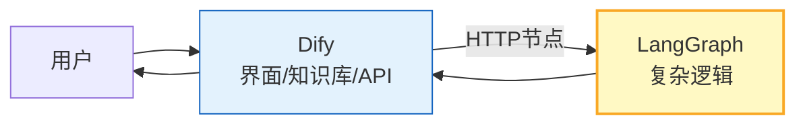

# 低代码 Agent 平台与 Dify/Coze 图解

> 不写代码也能搭 Agent？本图解可视化主流平台对比和选型决策。

---

## 平台定位

```mermaid
graph TB
    Q["选平台"] --> CODE&#123;"需要完全控制?"&#125;
    CODE -->|"是"| LG["LangChain/LangGraph<br/>纯代码"]
    CODE -->|"否"| HOST&#123;"自托管?"&#125;
    HOST -->|"是"| DIFY["Dify<br/>开源可部署"]
    HOST -->|"否"| EASE&#123;"易用优先?"&#125;
    EASE -->|"是"| COZE["Coze 扣子<br/>最易用"]
    EASE -->|"否"| RAG&#123;"专注RAG?"&#125;
    RAG -->|"是"| FAST["FastGPT<br/>RAG体验好"]
    RAG -->|"否"| FLOW["Flowise/LangFlow<br/>LangChain可视化"]

    style DIFY fill:#C8E6C9,stroke:#2E7D32,stroke-width:2px
    style COZE fill:#E3F2FD,stroke:#1565C0,stroke-width:2px
    style LG fill:#FFF9C4,stroke:#F9A825
```

---

## Dify vs Coze

| 维度 | Dify | Coze |
|------|------|------|
| 部署 | 自托管 | 云端 |
| 开源 | ✅ | ❌ |
| 易用 | 中 | 高 |
| 插件 | 中 | 丰富 |
| 渠道 | API | 飞书/微信 |

---

## 混合架构



---

## 检查清单

| 检查项 | 状态 |
|--------|------|
| 理解低代码 vs 代码 | ☐ |
| 平台选型 | ☐ |
| Dify 部署 | ☐ |
| Coze Bot 创建 | ☐ |
| 混合架构 | ☐ |
