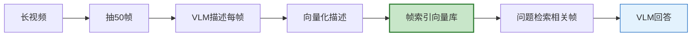

# 视频理解与多模态 Agent 图解

> Agent 能看视频吗？本图解可视化帧采样策略和视频理解方案。

---

## 帧采样策略

```mermaid
graph TB
    VIDEO["视频文件"] --> SAMPLING&#123;"采样策略"&#125;

    SAMPLING --> UNIFORM["均匀采样<br/>等间隔抽帧<br/>适合短视频/会议"]
    SAMPLING --> SCENE["场景切换采样<br/>检测画面变化<br/>适合监控/演示"]
    SAMPLING --> SMART["智能采样<br/>均匀+场景结合<br/>通用推荐"]

    style SAMPLING fill:#E3F2FD,stroke:#1565C0,stroke-width:2px
    style UNIFORM fill:#C8E6C9,stroke:#2E7D32
    style SCENE fill:#FFF9C4,stroke:#F9A825
    style SMART fill:#F3E5F5,stroke:#7B1FA2,stroke-width:2px
```

---

## 视频理解方案

```mermaid
graph TB
    Q["视频理解"] --> NATIVE&#123;"原生支持?"&#125;
    NATIVE -->|"是"| GEMINI["Gemini 1.5<br/>直接输入视频<br/>最佳效果"]
    NATIVE -->|"否"| FRAME["帧序列方案"]
    FRAME --> GPT4["GPT-4o 多帧<br/>每帧当图片<br/>Token多"]
    FRAME --> DESC["帧描述+LLM<br/>便宜VLM描述每帧<br/>贵LLM综合<br/>省Token"]

    style GEMINI fill:#C8E6C9,stroke:#2E7D32,stroke-width:2px
    style DESC fill:#FFF9C4,stroke:#F9A825,stroke-width:2px
```

---

## 视频 RAG



---

## 成本对比

| 方案 | 5帧成本 | 10帧成本 | 适用 |
|------|---------|---------|------|
| GPT-4o 直接 | $0.015 | $0.025 | 短视频 |
| 帧描述+LLM | $0.005 | $0.008 | 中视频 |
| Gemini原生 | $0.01 | $0.01 | 任何 |
| 视频 RAG | $0.003 | $0.003 | 长视频 |

---

## 检查清单

| 检查项 | 状态 |
|--------|------|
| 理解视频挑战 | ☐ |
| 帧采样策略 | ☐ |
| GPT-4o 帧序列 | ☐ |
| 帧描述省Token | ☐ |
| 视频 RAG | ☐ |
| 音频轨道处理 | ☐ |
