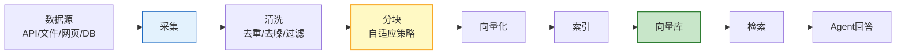
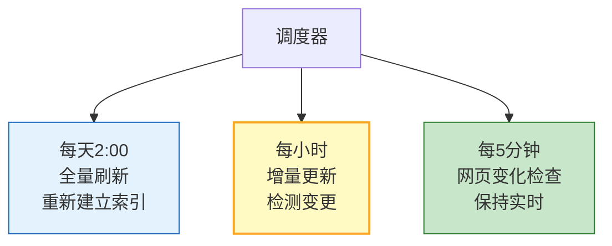

# Agent 数据管道与知识更新图解

> 知识库如何持续保鲜？本图解可视化数据管道全流程和增量更新机制。

---

## 数据管道全流程



---

## 增量更新

```mermaid
graph TB
    NEW["新数据"] --> DIFF&#123;"变更检测"&#125;
    DIFF --> ADDED["➕ 新增"]
    DIFF --> MODIFIED["📝 修改"]
    DIFF --> DELETED["➖ 删除"]

    ADDED --> ADD_VEC["添加到向量库"]
    MODIFIED --> DEL_VEC["删除旧版本"] --> ADD_VEC
    DELETED --> DEL_VEC2["从向量库删除"]

    style DIFF fill:#E3F2FD,stroke:#1565C0,stroke-width:2px
    style ADD_VEC fill:#C8E6C9,stroke:#2E7D32
    style DEL_VEC fill:#FFCCBC,stroke:#D84315
    style DEL_VEC2 fill:#FFCCBC,stroke:#D84315
```

---

## 定时调度



---

## 失效检测

| 检测项 | 触发条件 | 处理方式 |
|--------|---------|---------|
| 时间过期 | >90天未更新 | 重新采集/删除 |
| 链接失效 | URL不可访问 | 标记/删除 |
| 内容过短 | <50字符 | 质量检查 |
| 检索分数低 | Top得分<0.5 | 重新分块 |

---

## 检查清单

| 检查项 | 状态 |
|--------|------|
| 多源采集 | ☐ |
| 数据清洗 | ☐ |
| 自适应分块 | ☐ |
| 增量更新 | ☐ |
| 定时调度 | ☐ |
| 失效检测 | ☐ |
| 质量监控 | ☐ |
