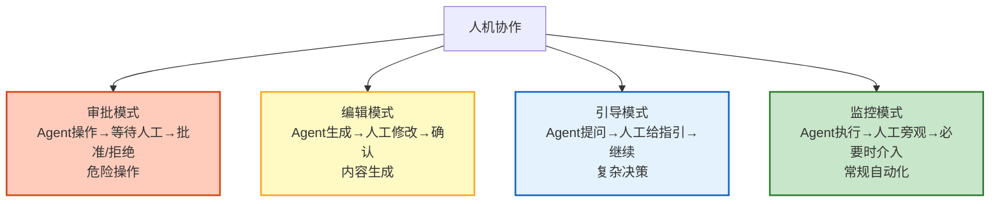
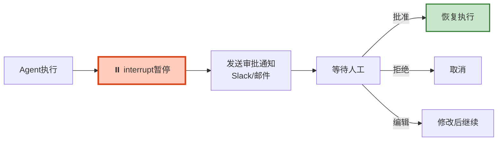

# 人机协作与 Human-in-the-Loop 深度图解

> Agent 操作前等人确认——四种 HITL 模式和风险分级审批。本图解可视化协作流程。

---

## 四种模式



---

## 审批流程

```mermaid
graph TB
    GEN["Agent生成草稿"] --> RISK&#123;"风险等级?"&#125;
    RISK -->|"低"| AUTO["自动通过"]
    RISK -->|"中"| SINGLE["单人审批"]
    RISK -->|"高"| DOUBLE["双人审批"]
    RISK -->|"极高"| TRIPLE["三人审批+超管"]

    AUTO --> EXEC["执行"]
    SINGLE -->|"批准"| EXEC
    SINGLE -->|"拒绝"| REJECT["取消"]
    SINGLE -.->|"超时"| TIMEOUT["超时降级"]
    DOUBLE -->|"全部批准"| EXEC
    DOUBLE -->|"任一拒绝"| REJECT

    style RISK fill:#FFF9C4,stroke:#F9A825,stroke-width:2px
    style EXEC fill:#C8E6C9,stroke:#2E7D32,stroke-width:2px
    style REJECT fill:#FFCCBC,stroke:#D84315
```

---

## interrupt 工作流



---

## 检查清单

| 检查项 | 状态 |
|--------|------|
| 理解四种HITL模式 | ☐ |
| 风险分级评估 | ☐ |
| interrupt审批流程 | ☐ |
| 多审批者协调 | ☐ |
| 超时降级 | ☐ |
| 审批通知 | ☐ |
