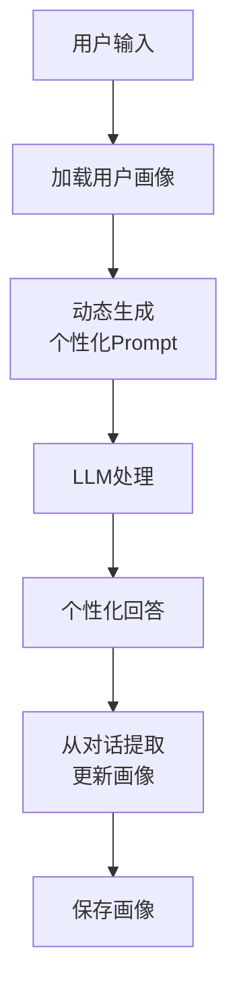
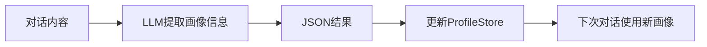

# 用户画像架构图解

> 用图解理解用户画像的构建、存储和使用流程。

---

## 一、个性化架构



## 二、画像数据结构

```mermaid
graph TB
    subgraph 画像 &#123;"用户画像字段"&#125;
        F1["user_id: 用户标识"]
        F2["name: 姓名"]
        F3["language: 偏好语言"]
        F4["tone: 语气偏好<br/>formal/friendly/casual"]
        F5["expertise: 专业水平<br/>beginner/intermediate/expert"]
        F6["interests: 兴趣列表"]
        F7["history_summary: 对话摘要"]
    end

    style 画像 fill:'#E3F2FD'
```

## 三、个性化效果对比

```mermaid
graph TB
    subgraph 无个性化 &#123;"无个性化"&#125;
        N1["所有用户相同Prompt<br/>相同语气<br/>不记得偏好"]
    end

    subgraph 有个性化 &#123;"有个性化"&#125;
        P1["按语气偏好调整<br/>记住用户身份<br/>推荐相关内容"]
    end

    style 无个性化 fill:'#FFCDD2'
    style 有个性化 fill:'#C8E6C9'
```

## 四、画像更新流程



## 五、选型建议

| 场景 | 个性化程度 | 方案 |
|------|-----------|------|
| FAQ | 低 | 不需要 |
| 客服 | 中 | 姓名+语气 |
| 教育 | 高 | 水平+历史 |
| 个人助手 | 高 | 完整画像 |
